# Automatic Test Packet Generation

**Hongyi Zeng, Peyman Kazemian, George Varghese, Nick McKeown**

---

## Summary

* This paper presents a network data plane testing scheme, Automatic Test Packet Generation (ATPG). ATPG examines the network failures by generating a maximum coverage testcases among all possible equivalent classes of rules. ATPG splits the header space (using atomic predicates?) and rule transitions into equivalent classes (by simulation in HSA). Therefore we can compress data-plane states into a few equivalent classes. Then we can extract a covering set from these combinations to produce a full coverage testcases and extract results. The faults can be localized by finding differences of sets between success/failure testcases.
* In my mind, this way to produce smart data-plane test packets strongly relies on the header space analysis model and computing and compressing all-pairs reachability easily. Because of that, this method has some limitations inherited from HSA: unable to handle dynamism, multi-path, transiency. If we have a non-determinism state machine model (or for dynamism, push-down automata) extension for HSA, we can also apply these optimizations on ATPG. A promising method would be introducing probabilistic programming into Hassel library to model multi-path by equal probability. Introducing probabilistic programming might also provide some benefits on modelling fault-tolerance.
  * [PLDI'19 - McNetKAT - Scalable Verification of Probabilistic Networks∗](https://www.cs.cornell.edu/~jnfoster/papers/mcnetkat.pdf)
* 

## Introduction

* ATPG: Automatic Test Packet Generation
  * configurations `=>` device-independent model
  * generate minimum set of test packets to exercise every link the network or exercise every rule in the network
    * from config & FIB, with minimum \# of packets required for complete coverage
  * test data plane state matching configuration specifications
  * detects and diagnoses errors by independently and exhaustively testing all forwarding entries, firewall rules, and any packet processing rules in the network 
  * link as normal forwarding rules
  * 
* 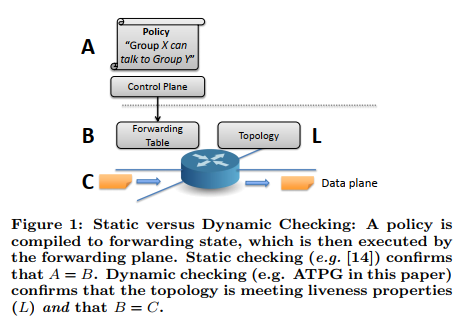

## Current Practice

* 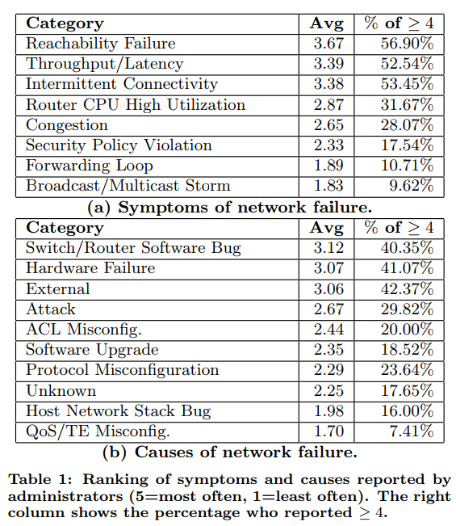
* 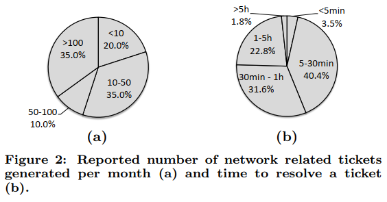
* 4 common symptoms can't be detected by static checks
  * throughput/latency
  * intermittent connectivity
  * router CPU utilization
  * congestion
* two most common symptoms (switch and router software bugs and hardware failure) are best found by dynamic testing  
* 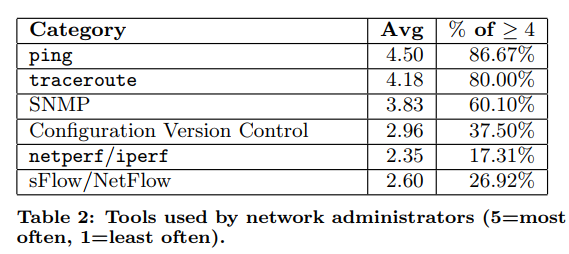

## Network Model

* HSA model
* 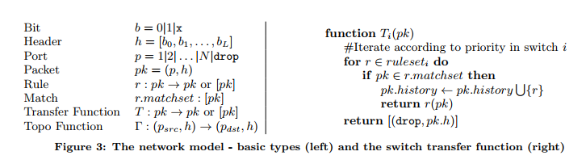
* 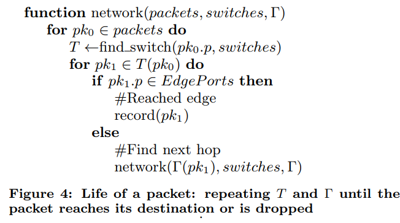

## ATPG System

* 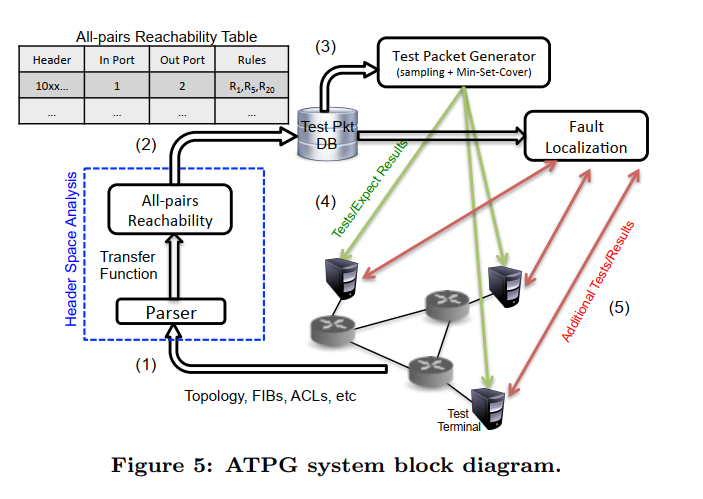

* Test Packet Generation

  * key constraints

    * Port: ATPG must only use test terminals that are available
    * Header: ATPG must only use headers that each test terminal is permitted to send  

  * > (Test Packet Selection). For a network with the switch functions, {T1, ...Tn}, and topology function, Γ, determine the minimum set of test packets to exercise all reachable rules, subject to the port and header constraints  

  * Test Packet Selection (TPS)

    * finds all equivalent classes between each pair of available ports (set of packets that exercises the same combination of rules)
    * samples each class to choose test packets  
    * compresses the resulting set of test packets to find the minimum covering set  
    * Step 1: Generate all-pairs reachability table  
      * computing the complete set of packet headers that can be sent from each test terminal to every other test terminal.  ([[Q: atomic predicate method?]])
      * For each such header, ATPG finds the complete set of rules it exercises along the path by applying the all-pairs reachability algorithm in HSA
      * 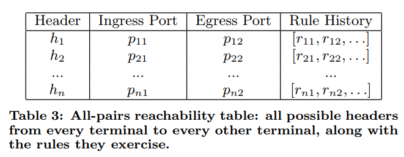
      * [[Q: equal-path history?]]
    * Step 2: Sampling  
      * ATPG picks at least one test packet in an equivalence class to exercise every (reachable) rule  
      * one packet per class: only detects faults for which all packets covered by the same rule experience the same fault (e.g. a link failure)  
        * rule-centric errors
      * detect faults specific to a header? need to select every header in every class  
        * header-centric errors
        * [[Q: why not just sample by header splits?]]
    * Step 3: Compression 
      * Several of test packets picked in Step 2 exercise the same rule. ATPG therefore selects a minimum subset of the packets chosen in Step 2 such that the union of their rule histories cover all rules  
      * cover choice
        * all links (for liveness only)
        * all router queues (for performance only)
      * NP-complete min-set-cover problem
      * greedy $O(N^2)$ approximation
    * 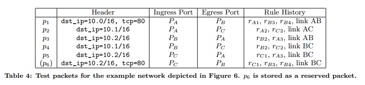

  * Properties

    * (Coverage). The set of test packets exercise all reachable rules and respect all port and header constraints.  
      * all-pairs reachability table
    * (Near-Optimality). The set of test packets selected by TPS is optimal within logarithmic factors among all tests giving complete coverage
      * inherited from Greedy Set Cover
    * (Polynomial Runtime). The complexity of finding test packets is $O(TDR^2)$ where 
      * `T` is the number of test terminals, 
      * `D` is the network diameter, 
      * `R` is the average number of rules in each switch  
      * proven by HSA technical report that one input port costs $O(DR^2)$ for computing reachability

* Fault Localization

  * Fault model
    * 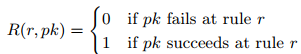
    * action faults
      * every packet matching the rule is processed incorrectly  
      * unexpected packet loss, a missing rule, congestion, and mis-wiring  
    * match faults
      * only affect some packets matching the rule 
      * when a rule matches a header it should not, or when a rule misses a header it should match  
      * exhaustive sampling such that 1+ test packet exercises each faulty region
  * Algorithm
    * 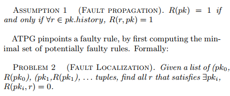
    * [[Q: Is fault propagation assumption too strong?]]
    * Step 1: Suspect rules 
      * Consider the results from sending the regular test packets  
      * For every passing/failings test, place all rules they exercise into a set of passing /failing rules  (P, F).
      * `F - P` is a set of suspect rules
    * Step 2: Trim rules
      * trim the set of suspect rules
      * use reserved packets whose rule histories contain exactly 1 rule from the suspect set, sends these packets
        * [[Q; does such reserved packets always exist?]]
        * if pass, remove rule, otherwise, mark rule as error
    * Step 3: Further trim
      * narrow down the suspect set further by sending test packets that exercise two or more of the rules in the suspect set using the same technique underlying Step 2  
      * If passing, infers none of the exercised rules are in rule
    * False positives: rules left
      * indistinguishable: two rules are in series and there is no path to exercise only one of them
        * [[N: network symmetry (core `->` hub)]]
        * ACL rule is followed immediately by a forwarding rule that matches the same header

  

## Use Cases

* Functional  testing
  * test the functional correctness of a network by testing that every reachable forwarding and drop rule in the network is behaving correctly  
  * Forwarding rule: A forwarding rule is behaving correctly if a test packet exercises the rule & leave correctly
  * Link rule: a special case of forwarding rule. A test packet passes correctly over the link without header modification
  * Drop rule: must verify the absence of received test packets  
    * conceptually flip each drop rule to a broadcast rule in the transfer functions  
    * 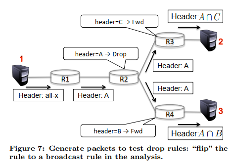
    * expect two test packets not to appear
* Performance testing
  * Congestion: generate one way congestion tests to measure latency between every pair of test terminals
  * Available bandwidth: generate the test packet headers needed to test every link/queue/service class  
  * Strict Priorities: determine if two queues, or service classes, are in different strict priority classes 
    * packets sent using the lower priority class should never affect the available bandwidth or latency of packets in the higher priority class.  
    * generating packet headers to congest the lower class, and verifying that the latency and available bandwidth of the higher class is unaffected  

## Implementation

* Python parser
* Hassel HSA
* `multiprocess`
* SQLite database
* JSON communication Network monitor
* Extensions: instruct switch/routers
  * Cooperative routers  
  * SDN-based testing  

## Discussion

* Overhead & Performance
  * main overhead: polling network for forwarding state & all-pairs reachability
  * speed up all-pairs reachability calculation using multi-threaded/multi-machine header space library
  * incremental state updater
* Limitations
  * dynamical boxes: can't model boxes whose internal state can be changed by test packets
  * non-deterministic boxes: ECMP-like multipath, can't model due to fixed rule history
    * [[Q: Do we have a extension for HSA on equal-cost path protocols?]]
    * [[N: Probabilistic programming?]]
  * Invisible rules: backup rules can be activated
  * Transient network states: congestion may disappear before an available bandwidth probing test
  * Sampling: miss match faults since the error is not uniform across all matching headers

