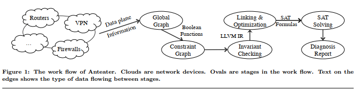
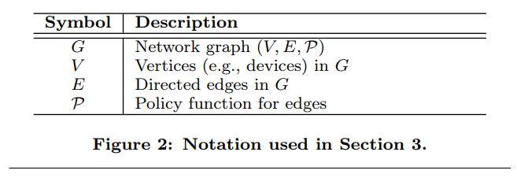
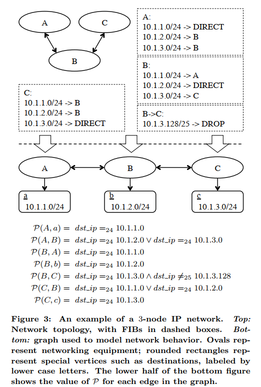
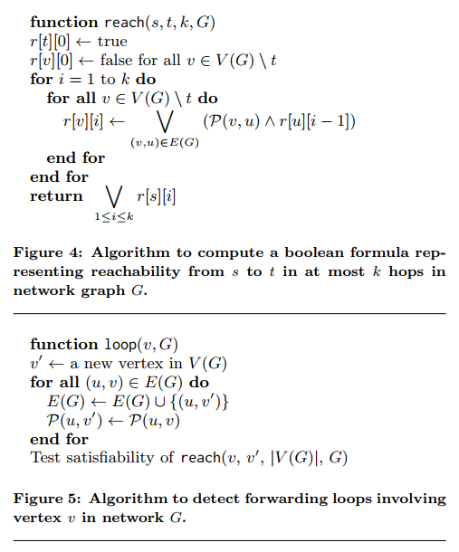
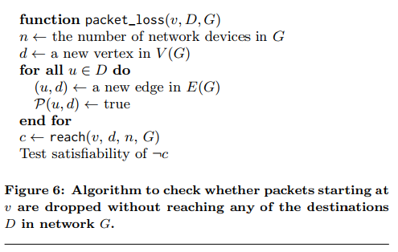
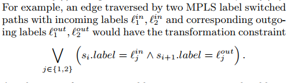
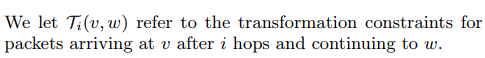
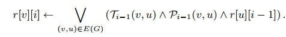

# ‎Debugging the Data Plane with Anteater‎

**Haohui Mai, Ahmed Khurshid, Rachit Agarwal, Matthew Caesar, P. Brighten Godfrey, Samuel T. King**

---

## Summary

* This paper proposes Anteater, a system leveraging boolean formulas and SAT solvers to check network invariants in data plane. Anteater converts topology, FIBs and invariants into boolean functions and use a SAT solver to find solutions or proofs. The reachability problem is encoded using a dynamic programming algorithm and some other algorithms (loop, blackhole, consistency) can be converted to the reachability problem. For packet rewriting, Anteater uses a series of symbolic packets instead of single packet. The implementation of Anteater treats policy functions, rewriting functions and invariants as LLVM IR objects, and link them to a SAT solver.
* This paper leverages complex boolean formulas and SAT solvers to compute reachability. The implementation is interesting as they leverages LLVM IR and object linking. I have some questions about the complexity of boolean formulas while packet rewriting exists, and the complexity of encoding a new invariant. It would be better to provide some examples.
* a) Can you explain their dynamic programming algorithm for converting a set of network rules to a SAT formula without writes?
  * The algorithms initializes destinations as true and the rest nodes as false. For each hop, the algorithm computes the possible sources can reach the destination from the previous state. The final result is whether the packet can be originated from source in k hops. The loop detecting algorithm introduces a new vertex v', copying all outgoing edges from one vertex  v and test if v' is reachable from v. For blackhole detecting, introduce a sink vertex and leads edges from each vertex to the new vertex, and test if the new vertex is not reachable (which means a blackhole or loop).
* b) How they do model writes (much more complex than with Datalog!)?
  * Anteater uses symbolic packet history instead of one symbolic packet. And they extend the algorithms with transformation functions on adjacent packet history.
* c) How do they show network reachability is NP complete (just sketch the idea, its really easy, and in the Appendix). Its actually PSPACE complete with writes but this is an easy proof.
  * They show reachability is NP-complete by reducing 3-SAT to reachability. The 3-SAT problem is encoded as a symbolic packet (each bit as variable T/F). Each clause is a node and every literal is an directed edge from current clause to the next clause. Therefore, the 3-SAT problem is reduced to reachability problem from first clause to the final clause.
* **Midterm:** We will have a midterm next Thursday. It will be a 2 hour CCLE quiz of 2 hours you can take any time in 24 hours starting Thursday at 11 am PST. It will have a network and a set of rules you will model using HSA, Atomic Predicates, Datalog, and SAT and 10 short questions based on the papers. It will be open book. Easiest way to prepare is work with some other students to take a simple network and model it with these 4 modelling languages (so the Anteater and Atomic Predicates papers will be important). It will be an easy exam if you practice before. 
* 

## Introduction

* static analysis of the data plane
* heuristics: sending probes, reviewing logs, observing mailing lists/phone calls
* configuration analysis (control plane analysis)
  * cannot find bugs in router software
  * model complex configuration languages & dynamic protocol behavior
* Anteater: checking invariant in the data plane (uniformed representation & real situation)
  * high-level network invariant `=>` SAT problems
  * network topo + forwarding info base (FIB) `=>` boolean function `=>` SAT solver

## Overview

* 
* invariants:
  * loop-free forwarding
  * connectivity
  * consistency
* FIBs `<-` vtys / SNMP / control sessions
* input invariants (Ruby)
* FIB + invariants `->` SAT `->` SAT solver

## Anteater Design

* 
* 
* 
* [[N: DP algorithm for reachability]]
* 
* consistency: test two nodes and use `xor`
* packet rewriting
  * symbolic packet history: an array of symbolic packets
  * 
  * 
  * include the transformation constraints T in addition to the policy constraints P  
  * the edge policy function P(u, v), rather than referring to variables in a single symbolic packet s, will be applied to various entries of the symbolic packet array (si)  \
  * 
  * negation `=>` packet not allowed OR unreal history (eliminate this)
    * instead, add sink node for each non-destination nodes on complement of range
    * check if can be dropped (go to sink node) within n - 1 hops (n is the number of all nodes)

## Implementation

* C++, Ruby
* LLVM IR of boolean functions as objects
* LLVM links functions
  * use LLVM simplify expression & inlining
* compile invariants as compiling C/C++ projects!
* SLang: Prolog-like DSL for invariants

## Discussion

* Collecting FIB snapshots in a dynamic network  
  * FIB could change in collection `=>` false positive/negatives
  * consistent snapshot algorithm
  * SDN centralized controllers
* Collecting FIB snapshots in the presence of network failures  
  * maintaining separately tunneled networks at the forwarding plane  
  * operating through out-of-band control circuits  
* Complexity proof
  * longest prefix match only `=>` poly time
  * otherwise `=>` NP-complete
  * calculate reachability formula: $O(V^3)$
  * 

