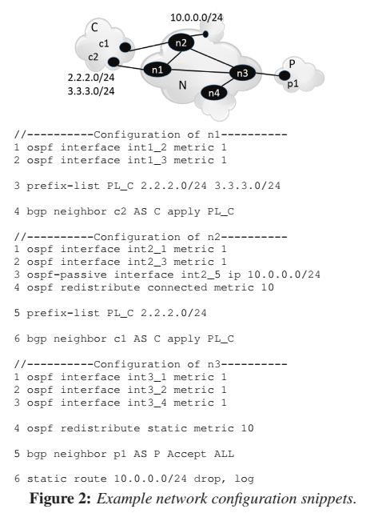
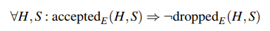
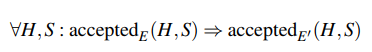
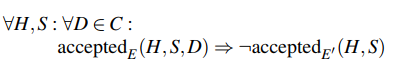
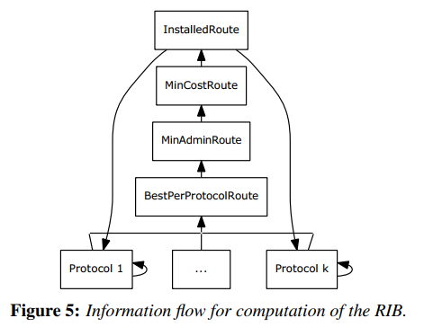

# ‎A General Approach to Network Configuration Analysis  

**Ari Fogel, Stanley Fung, Todd Millstein et al.**

---

## Summary

* This paper proposes a tool to analyze network control plane, `Batfish`. `Batfish` parses configuration files and topology into a control plane model (LogiQL facts). Then it feeds the model with environment (link status, announcements). Based on the nature of declarative languages, multiple data plane models are generated when queried. The result models, along with safety properties encoded, are fed into NoD and Z3 to generate counterexamples. The counterexamples serves as extra facts, therefore the data-plane populates facts about the error conditions. Users can query these facts for tracking back the configuration lines.

* The authors present a way in the middle of static analysis and snapshot analysis. Based on the control plane, sample of data planes are generated and checked. This is like a concolic testing or fuzzing. What worries me is the efficiency: exponential number of data plane could be generated and constraint solving is also a NP problem. As a compromise, a full fuzzing way (fuzzed data-plane from control-plane and packets) or a integrated declarative backend (LogiQL+NoD+Z3) might be needed to scale this method on large network.

* > Concolic execution uses a concrete input and runs the program while gathering path constraints with respect to that input. Note that this is fast, because you are not using the solver, you are just gathering constraints. Once the program terminates on that input, concolic execution will pick a certain constrain, negate it, ask the solver for a new input and re-execute the program on that input.
  >
  > Notice that this is lightweight as you don't interfere with the running of the program much and use the solver to just get new inputs.
  >
  > Classical symbolic execution needs to call the solver on every branch point, which makes it slow to reach deeper parts of the code. Concolic execution doesn't suffer from this problem as deeper parts of the code are exercised in each iteration (re-execution). On the other hand concolic execution re-execute the starting bits of the program multiple times, which is unnecessary. So if you want to fully explore all the paths classical symbolic execution will use less resources, because it won't re-execute parts of the program unnecessarily. If you just want to find bugs, concolic execution might be better as you will reach deeper parts of the program quicker.


## Introduction

* proactively: before application, answer "what if" questions
* check forwarding properties + produce actual packets that violate checked properties
* analyze data plane snapshots
  * declarative derivation of data plane
* detect network configuration errors
  * analyze configuration directly `=>` static analysis
    * but real networks are complex  (BGP, OSPF, ACLs, VLANs, static routing, route redistribution)
    * customized models for specific aspects/correctness properties
  * analyze dataplane snapshots
    * reflect the combined impact of all configuration aspects
    * well-understood semantics
    * but how to proactively?
    * how to localize the responsible snippets? complex impact chains
* 
  * derive the actual data plane that would emerge given a configuration and environment  
  * low-level for accurate data-plane
  * high-level for operators to identify errors and convert back configuration snippets
  * `Batfish`
    * Configuration + Environment + Protocol Behavior `=>` Datalog (LogiQL)
    * `=>` logical relations of data-plane + key concepts in the computations (best route, ...)
    * `=>` automatic constraint solver for checking properties `=>` produce violating packets
    * `=>` feed back declarative model + relational facts (path, ACL)
    * 3 novel properties related to consistency
      * multipath consistency: in presence of multipath routing, packets of a flow are either dropped along all paths they traverse or reach the destination along all paths
      * failure consistency
      * destination consistency


## Background & Motivation

* The data plane state of each device determines how packets with a given header are handled (e.g., dropped, forwarded to a specific neighbor, or load balanced across multiple neighbors).  

  * generated by control plane

* autonomous system (AS)

  * > Within an AS, information on network topology and connected destinations is exchanged using interior gateway protocols such as OSPF [23], a protocol that computes least-cost paths  

* SDN: control plane is specified using a control program instead of configuration

* 

  * > The first error is that 3.3.3.0/24 is missing from the definition of PL C in n2, and thus n2 will drop announcements and not provide connectivity for this prefix. This error may go unnoticed when the configuration is applied since connectivity to 3.3.3.0/24 is available through n1. But when n1, c2 or link c2-n1 fails, all connectivity to 3.3.3.0/24 will be lost. The end result of this error is lack of fault tolerance and poor load balancing (since link c2- n1 carries all traffic for 3.3.3.0/24) 

    * data-plane analysis can't find this failure until it breaks reachability to 3.3.3.0/24

  * > Because n2 and n3 redistribute connected and static networks, respectively, n1  will learn paths to 10.0.0.0/24 from both these neighbors, and the paths will have the same routing cost. Under these conditions, the default is multipath routing; that is, n1 will send packets to 10.0.0.0/24 through both neighbors. However, only packets sent through n2 will reach
    > the destination since n3 will drop such packets. Thus, traffic sources will experience intermittent connectivity  

    * static analysis targeting specific patterns could not detect this failure since it requires a precise model of the semantics of OSPF, connected routes, static routes, interactions


## Overview of `Batfish`

* 

* Configuration `->` Data Plane

  * LogiQL: Datalog + integer + arithmetic + aggregation

  * ```
    //Part 1a: Facts on OSPF interface costs
    OspfCost(n1, int1_2, 1)
    ...(remaining OSPF interfaces)
    
    //Part 1b: Facts on OSPF adjacencies
    OspfNeighbors(n1, int1_2, n2, int2_1).
    OspfNeighbors(n1, int1_3, n3, int3_1).
    OspfNeighbors(n2, int2_3, n3, int3_2).
    ...(symmetric facts)
    
    //Part 2: Rules that capture basic OSPF logic
    BestOspfRoute(node, network, nextHop, nhIp, cost) <-
    	OspfRoute(node, network, nextHop, nhIp, cost),
        MinOspfRouteCost[node, network] = cost.
        
    MinOspfRouteCost[node, network] = minCost <-
        minCost = agg<<cost = min(cost)>>:
        OspfRoute(node, network, _, _, cost).
        
    OspfRoute(node, network, nextHop, nextHopIp, cost) <-
        OspfNeighbors(node, nodeInt, nextHop, nextHopInt),
        InterfaceIp(nextHop, nextHopInt, nextHopIp),
        ConnectedRoute(nextHop, network, nextHopConnInt),
        OspfCost(node, nodeInt, nodeIntCost),
        OspfCost(nextHop, nextHopConnInt, nextHopIntCost),
        cost = nodeIntCost + nextHopIntCost.
        
    OspfRoute(node, network, nextHop, nextHopIp, cost) <-
        OspfNeighbors(node, nodeIntCost, nextHop, nhInt),
        InterfaceIp(nextHop, nhInt, nextHopIp),
        OspfNeighbors(nextHop, _, hop2, _),
        BestOspfRoute(nextHop, network, hop2, _, subCost),
        node != secondHop,
        cost = subCost + nodeIntCost.
    ```

  * Environment input: up/down status of each link + a set of route announcements from each of the network's neighboring ASes

  * Fixpoint DP derivation

    * all rules are fired iteratively to derive new facts, until no new facts are generated (natural behavior of prolog)
    * The resulting data plane model includes the forwarding behavior of individual routers as logical facts that indicate whether a packet with certain headers should be dropped (e.g., `Drop(node, flow)`) or forwarded to a neighbor (e.g. `Forward(node, flow, neighbor)`)  
      * includes facts for all of the intermediate predicates used in the rules  
    * [[Q: will all state be generated? or a sample? How to sample? How to overcome the sequential outcome of Datalog?]]
    * [[N: can we automatize the process by a parser?]]

* `Data Plane -> Configuration Errors`

  * data-plane relations + correct properties `=>` Z3 constraint solver `=>` verify/counterexamples
  * logically simulating the behavior of counterexample packets through the network on top of our logical data plane model
  * [[Q: how does the provenance checker work?]]

* assume that routers behave as expected based on their configurations. 

* cannot catch errors due to bugs in router hardware or software  

* can miss errors that occur only in environments that the operator has not supplied  

  * operators can supply infeasible environment `=>` fail to model something...

* encounter configuration features that are currently not implemented (e.g., the internal ‘color’ metrics of Juniper) but may influence local route selection  

  * currently-unimplemented features can be mapped to this representation simply by adding logical rules to our control-plane model for how they impact forwarding  

  

## Consistency Properties

* `E`: environment
* `accpeted{E}(H, S, D)`: header `H` is eventually accepted (reach destination/forwarded outside the modeled network) at node `D` when injected into the network at node `S`
* `dropped{E}(H, S, D)`
  * not mutually exclusive: equal-cost paths
* `accepted{E}(H, S): exists D: accepted{E}(H, S, D)`
* Multipath Consistency
  * 
  * every packet is either accepted on all paths or dropped on all paths  
* Failure Consistency
  * reason about whether the network configuration is indeed as fault tolerant as intended  
  * between `E` & `E'` (`E` + subset of links/nodes considered failed)
  * 
  * full definition: requires H to be destined for an active interface in E'
* Destination Consistency
  * allow a customer AS to only send route announcements for its own address space, ensuring that it only receives packets destined to itself  
  * `E'`: `E`  (customer ASes only, provider, peer AS nodes are considered failed) + all links to a customer AS `C`failed
  * 
  * any packet that is accepted by some node D in the AS C should not be accepted once C is removed  


## Four Stages of `Batfish`

* Modeling the Control Plane

  * configuration files + network topology `=>` parsed into IR `=>` logical facts

    * `SetIpInt(Foo, f0/1, 1.2.3.4, 24)`: interface `f0/1` of node `Foo` has IP address `1.2.3.4` with 24-bit subnet mask

  * route computation for various protocols

    * capture the process by which RIB entries are generated at each node  
    * 
    * `BestPerProtocolRoute`: the set of routes that are optimal according to the rules of one of the routing protocols  
    * `MinAdminRoute`: the subset of `BestPerProtocolRoute` with only routes that have minimal administrative distance, a protocol-level configuration parameter 
      * route `R` to destination `D` from `BestPerProtocolRoute` if the protcol that produced `R` has an administrative distance no higher than that of any other protocol that produced a route to `D` 
    * `MinConstRoute: `the subset of `MinAdminRoute` with only those routes that have minimal protocol-specific cost  
      * route R to destination D from `MinAdminRoute` if R has a protocol-specific cost no higher than that of any other route to D in `MinAdminRoute`
    * `InstalledRoute`: the set of routes that are selected as best for the node. 
      * identical to `MinCostRoute` but is given a new name for clarity  
      * also shows the dependency of protocols on previous state

  * routing information base (RIB)

    * a typical RIB entry minimally contains a destination network, the IP address of the next hop for that network, and the protocol that produced the entry  
    * each node may be configured to run one or more routing protocols  
    * at each node, each protocol iteratively computes its best route to each destination in the network using information learned from neighbors  

  * ```
    InstalledRoute(node, network, nextHop, 
    	nextHopIp, admin, cost, protocol) <-
    		MinCostRoute(node, network, nextHop,
    			nextHopIp, admin, cost, protocol).
    
    MinCostRoute(node, network, nextHop,
    	nextHopIp, admin, minCost, protocol) <-
    		minCost = MinCost[node, network],
    		MinAdminRoute(node, network, nextHop,
    		    nextHopIp, admin, minCost, protocol).
    
    MinCost[node, network] = minCost <-
    	agg<<minCost = min(cost)>>
    	MinAdminRoute(node, network, _, _, _, cost, _).
    
    MinAdminRoute(node, network, nextHop,
    	nextHopIp, minAdmin, cost, protocol) <-
            minAdmin = MinAdmin[node, network],
            BestPerProtocolRoute(node, network,
    	        nextHop, nextHopIp, minAdmin, cost, protocol).
    
    MinAdmin[node, network] = minAdmin <-
    	agg<<minAdmin = min(admin)>>
    	BestPerProtocolRoute(node, network, _, _, admin, _, _).
    ```

* Building the Data Plane

  * data-plane: forwarding information base (FIB) for each node  

    * node's RIB
    * configured ACLs for the node's interfaces
    * rules for using items to forward traffic

  * Environment `=>` `LogiQL` program (output of last stage)/CP model `=>` RIB for each node

  * ```
    FIBChecker(interface, packet, dropped, _) = 
    	HasACL(interface),
    	ACLDeny(packet).
    	
    FIBChecker(interface, packet, accepted) = 
    	ACLAllow(packet),
    	DestAssignedToInterface(packet, dest),
    	SelfInterface(dest)
    	
    FIBChecker(interface, packet, accepted) = 
    	DestIp(packet, dest),
    	LongestPrefixMatch(dest, rules, protocol),
    	RIB(protocol, entry),
    	DirectConnected(entry, dest_interface),
    	Send(dest_interface).
    	// otherwise	
    	LongestPrefixMatch(OriginalNexthop)...
    
    ```

  * [[Q: Why we need RIB? Seems we can directly forward it?]]

* Property Checking

  * can ask LogiQL for queries on control/data-planes
  * Network Optimized Datalog (NoD) : extension of the Z3 constraint solver, to identify violations of correctness properties
  * ask NoD if its negation `!P` satisfibale in the context of the given data plane models
    * if so, provide the complete boolean formula expressive how to satisfy the negation of the property
    * a set of constraints on a packet header & interface
  * query Z3 to solve constraints `=>` concrete counterexample

* Provenance Tracking

  * each counterexample from the previous stage is converted into a concrete test flow in terms of our LogiQL representation of the data plane  
  * this test flow is “injected” into our logical model, causing LogicBlox to populate relevant relations with facts that indicate the path and behavior of the flow through the network  


## Implementation

* Java + Antlr parser generator
* vendor and language-agnostic representation for control plane information
* regular-expression: might have semantic mismatch, not supported for LogiQL
  * precomputing the result of the match for all communities mentioned in configuration files and the environment
  * AS-path matching may have problem `=>` AS-path not statically known


## Evaluation

* Net1: BGP
* Net2: VLAN


## Conclusion

* 


