# ‎Efficient Network Reachability Analysis using a Succinct Control Plane Representation  ‎

**Seyed K. Fayaz, Tushar Sharma, Ari Fogel, Ratul Mahajan, Todd Millstein, Vyas Sekar, George Varghese**

---

## Summary

* This paper builds a scalable network reachability analysis tool, called ERA, for network control plane. Instead of analyzing on data plane (considering forwarding table and ACLs), ERA focuses on control plane and supports various kinds of protocols (BGP, OSPF, RIP, etc.). ERA leverages a succinct bit-vector model (ip, mask, AD, protocol attributes) to model several kinds of protocols and BDDs as visibility functions on input routes to output routes. To increase the scalability, ERA employs three techniques: Karnaugh map for minimizing collection of routes; atomic equivalent classes and bit-vector encoding so the conjunction can be bit-wise AND/OR operations; and fast set operations by vectorized instructions (AVX2). To use ERA, the user should provide the environment assumption (route advertisements sent by outside), topology, configuration and a reachability policy checking if a data-plane is policy-compliant. ERA builds the BDD representation of the routers, computes the reachability to build the potential input space and check if the prefixes are compliant with the given policy.
* This paper is technical and innovative. By abstracting a succinct data plane bit-vector representation, ERA is able to satisfy the scalability and generality requirements. I'm confused on the reachability computing using the BDDs. On which input space does ERA generate the equivalent classes (route announcement or internal representations) and how they identify all boolean terms?  Why the ACL rules are not included in the router model? Some technical improvements: distributed version of ERA (like NetPlumber, what information must be shared?), longer vectors (SSE3, AVX512), using SDD (sentential decision diagram) instead of BDD for a more succinct representation (need a good v-tree to keep canonicality). The paper reveals a very general scheme to improve the scalability of frameworks: providing succinct yet efficient data structure, abstracting representations, and apply implementation optimizations.

## Route Visibility Function

* 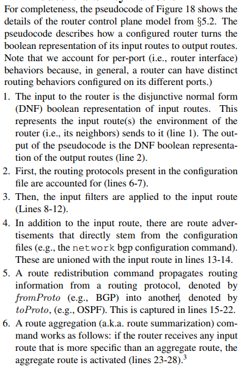
* 
* 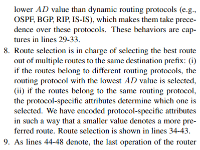
* 
* 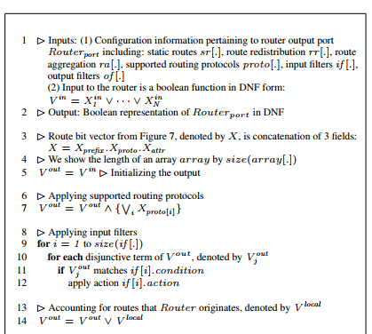
* 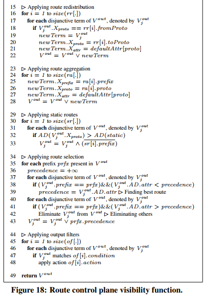
* 

## Introduction

* Reasoning about network: constant churn
  * new route announcement/advertisement arrive
  * link fail
  * router offline for maintenance
* Current network reachability analysis techniques are limited: only reason able the current incarnation of network or too slow to enable exploration of many environment
* ERA: reason about network "control plane" generates these incarnations
  * succinct model of network control plane
    * design a unified control plane model that succinctly captures the key behaviors of various routing protocols  
    * router: a function accepts a route announcement as input, produces a set of route announcement for its neighbors
    * BDDs to compactly represent the route announcements that constitute a user-specified environment
    * shrink the BDD representation of router announcements by identifying equivalence classes of announcements treated by the given work
    * vectorized instruction sets
  * repertoire of techniques for scalable exploration of this model
* 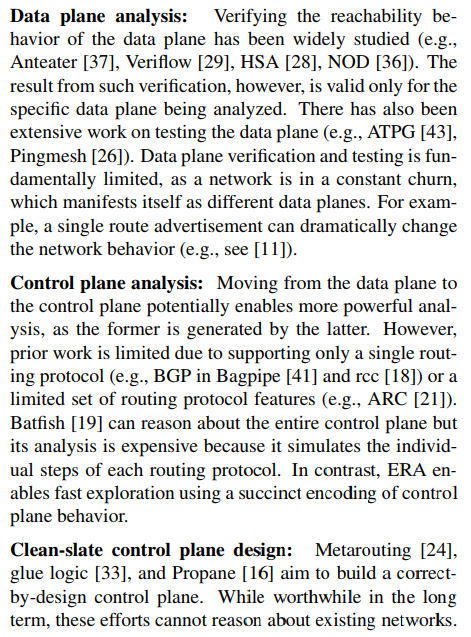

## Motivation: Reachability Bugs

* Maintenance-triggered
  * unexpected interactions of different routing protocols & configuration directives
  * 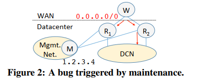
  * the operator had forgotten to type keywords to indicate that the static route belonged to the management network, not data network
* Announcement-triggered
  *   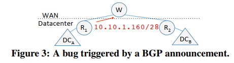
  * sinkhole semantics of route aggregation: aggregating router drops packets for subprefixes for which it does not have an active route to prevent routing loops  
* Failure-triggered
  * 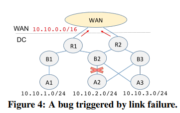

## ERA Overview

* target: datacenter/ISP/enterprise network of a realistic size (100+ routers)
* 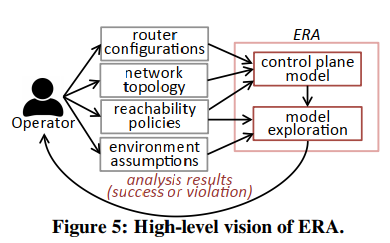
* relationship between data/control plane
  * data plane as a function `DP: (pkt, port) -> (pkt, port)`
  * control plane as function `CP: (env, Topo, Configs) -> DP(.)`
    * env captures the router advertisement sent to the network by the outside world
* reachability policies via control plane analysis
  * $\phi_{A \to B}(pkt, DP)$: reachability policy
  * analyze the control plane under that environment to determine  
    * the routes that each router in the network learns via its neighbors (e.g., a BGP advertisement) or its configuration file (e.g., static routes)
    * the best route when multiple routes to the same prefix are learned  
  * 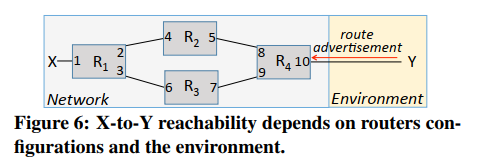
  * 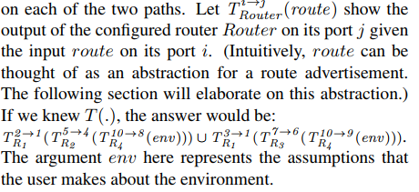
* control-plane based reachability analysis requires to address 2 key challenges
* An expressive & tractable control plane model
  * capture key behaviors of diverse protocols (BGP, OSPF route advertisements)
* Scalable control plane exploration
* Scope & Limitations
  * requires the user to provide assumptions on the environment (or defaults to assuming that the environment makes all possible route announcements)  
  * false positives: incorrect, overly permissive assumptions
  * false negatives: environments, transient errors
  * don't support certain directives (regexp)

## Modeling the Control Plane

* captures all routing protocols using a common abstraction  
* expressive with respect to routing behaviors of individual protocols  
* lends itself to scalable exploration  
* break down problems
  * the I/O unit of a router’s control plane  
  * the processing logic of a router’s control plane  
* Route as the Model of Control Plane I/O  
  * naïve way: use actual specification of route advertisements of different routing protocols (keep-alive, seq num)
  * abstract route: succinct, expressive I/O unit for the control plane model
    * mimics a route advertisement
    * succinct bit-vector conveying key information in route advertisements that affects routing decisions
    * 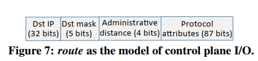
    * 128-bit SSE2 operations
    * Destination IP and mask: Together, they represent the destination prefix that the route advertises.  
      * mask in 5 bits (instead of 32 bits native storage)
      * 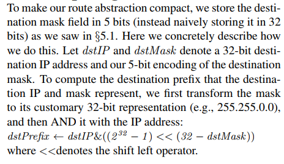
    * Administrative distance (AD): This is a numerical representation of the routing protocol (e.g., BGP, OSPF)
      of the route such that `AD{A} < AD{B}` denotes routing protocol A is preferred to protocol B
    * Protocol attributes: protocol-specific attributes of the routing protocol represented by AD  
      * BGP AD: weight, local preference
    * encode preferring route to be `AD1.attr1` and `AD2.attr2` when interpreted as unsigned integers (`.` as concatenation)
* Control Plane as a Visibility Function  
  * key operations
    * Input filtering: which modifies/drops incoming route advertisements to the router; 
    * Route redistribution: which is necessary to capture cross-protocol interactions [31,33]; 
    * Route aggregation, which is a common mechanism to shrink forwarding tables, yet its improper use can lead to reachability violations
    * Route selection, which is in charge of selecting the best route to a given destination prefix
    * Output filtering, which modifies/drops outgoing route advertisements  
  * lift router model to work simultaneously on a set of route announcements
  * 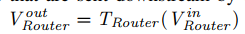
  * BDDs to symbolic encode the set of I/O routes in a router model
    * We can `Apply(L, R, BinOp)` in polytime easily
  * 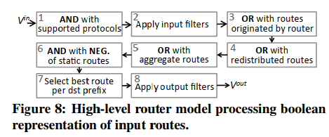
  * `V{in} -> V{out}`
    * Supported protocols: First, the routing protocols present in the configuration file are accounted for  
    * Input filtering: Then, the input filters are applied.
    * Originated routes: In addition to the input route, there are routes that directly stem from the configuration files, which are conceptually OR ed with the input.
    * Route redistribution: A route redistribution command propagates routing information from a routing protocol (e.g., BGP) into another protocol (e.g., OSPF).
    * Route aggregation: If the router receives any input route that is more specific than any configured aggregate route, the aggregate route gets activated.
    * Static routes: A static route is a route locally known to the router (i.e., not shared with its neighbors). Further, by default, static routes take precedence over dynamic routes (e.g., OSPF, BGP, RIP, IS-IS) due to having a lower AD value. This behavior is captured by ANDing the negation of static routes with all other routes.
    * Route selection: Selecting the best of multiple routes to a destination prefix works as follows: 
      * (i) if the routes belong to different routing protocols, the one with the lowest AD value is selected, 
      * (ii) if the routes belong to the same routing protocol, the protocol-specific attributes determine the winner.
    * Output filtering: The router applies its output filters.  
  * 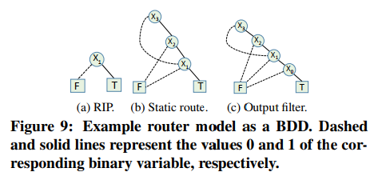
  * 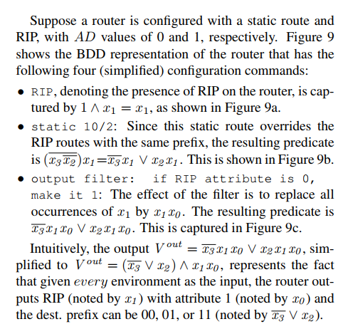

## Exploration the Model

* Karnaugh map
* Equivalence Classes
* Vectorized CPU instructions
* 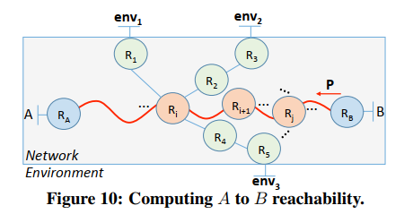
* Exploration Method on policy violations
  * Apply the effect of the environment
    * 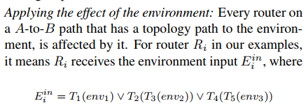
  * Computing routes reachable from B to A  
    * 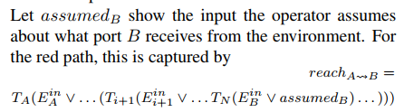
  * Extracting prefixes reachable from A to B  
    * 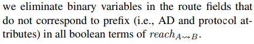
  * Accounting for on-path static routes  
    * 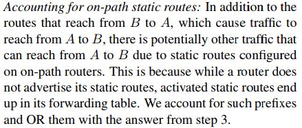
  * Applying ACL rules affecting A-to-B traffic  
    * 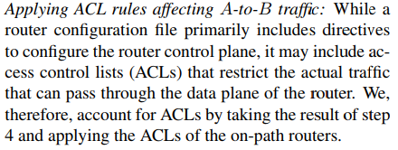
  * apply policy $\phi_{A \to B}(pkt, DP)$
  * use Karnaugh map to the DNF representation of the violating routes to provide human operators with fewer distinct items to investigate
* Scalability Optimizations
  * Minimizing collection of routes with the K-map: minimize the binary representation of the router I/O  
  * Finding equivalence classes (atomic predicates)
    * 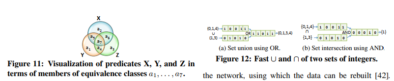
    * 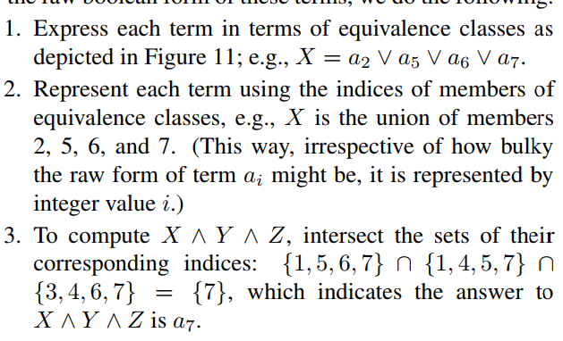
  * Implementing fast set operation
    * computing union and intersection of sets of integers  
    * using bit-vector bit-wise AND/OR
    * AVX2

## Going beyond Reachability

* Valley-free routing  
  * traffic from a neighboring peer or provider must not reach another such neighbor  
  * a form of reachability policy that ERA can easily check  
* Equivalence of two routers  
  * checking if operators are identically configured
  * use ROBDD canonicality
  * check adjacency matrix representation of BDDs $O(n^2)$
* Blackhole-freeness
  * router unintentionally drops traffic
  * 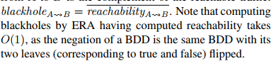
* Waypointing
  * explicitly checking whether traffic reachable from A to B goes through the intended routers  
* Loop-freeness
  * find permanent forwarding loop by checking whether the same router port appears twice the reachability result
* 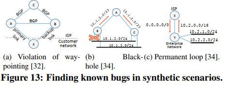

## Implementation

* Batfish config parser
* Java & JDD
* C & AVX2
* [[C: the evaluation part of this paper is interesting]]

