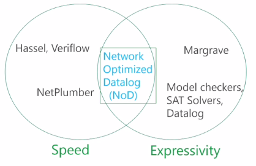
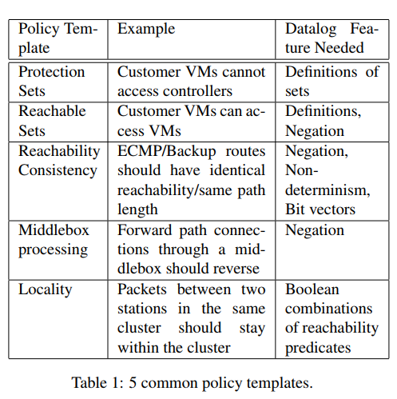
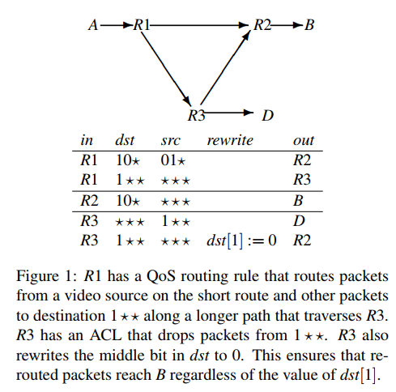
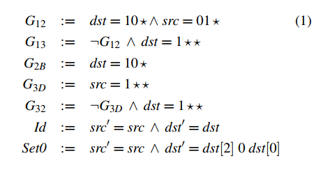
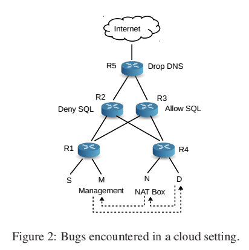
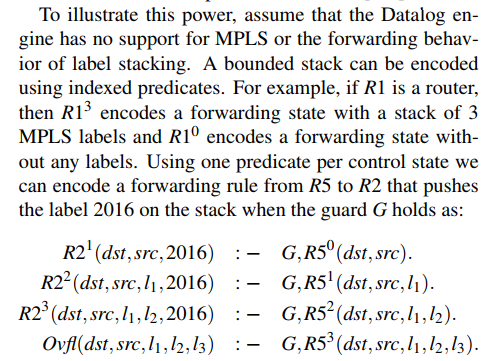
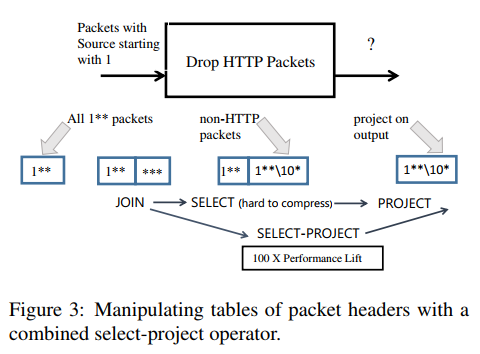
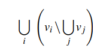
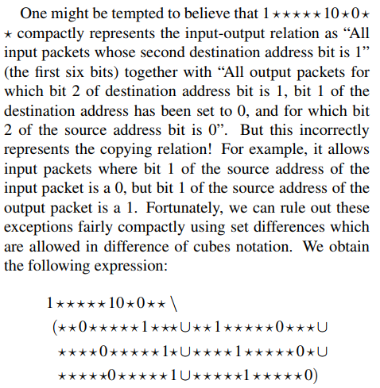
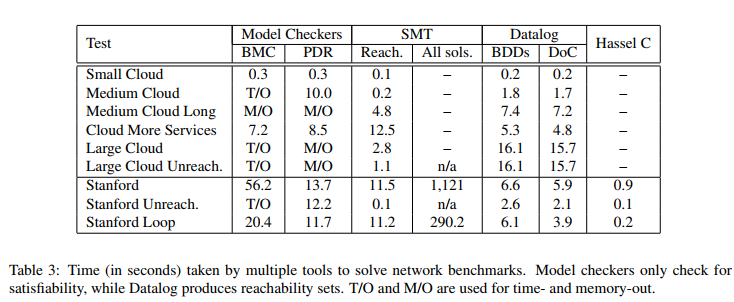

# Checking Beliefs in Dynamic Networks

**Nuno P. Lopes, Nikolaj Biorner (Z3), Patrice Godefroid, Karthick Jayaraman, George Varghese**

---

## Summary

* This paper purposes a general network verification tool, Network Optimized Datalog (NoD). NoD satisfies five key features for network verification tools: return all solutions; handle packet rewriting; scale to large header space; provide general specification language and modelling language. The authors show they can encode complex protocols (e.g., MPLS) in Datalog language, which requires recursion/fixpoint semantics implementable in that programming language. To speed up Datalog, the authors leverage Differences of Cubes (DoCs)/BDDs to represent header space and merge `select` and `project` operators into `select-project` relation to avoid inefficient materialization in `select` stage. DoC efficiently models the transfer functions of routing rules and handles the packet rewriting.
* The tool is very promising as it presents a general and efficient background for network verification. The question I have is how to do projection on DoCs and the details of select-join with rewriting. Based on the paper, does it mean we generate copy-violation predicates and only do aggregation of equivalent classes fields in projection and delay all the other computations? Also, besides optimizing the rules (like symmetry paper), we can use a high performance language with a DSL to transpile to improve speed, or leveraging some JIT techniques for NoD to improve performance (as compared to Hassel C).
* a) What is all this fuss about beliefs? What is a belief in this paper.
  * Belief is a high-level invariant checking in the verfiication tool. A belief in NoD is a Boolean combination of reachability predicates represented by Datalog.
* b) Can you explain the somewhat complex bug in Figure 2
  * Figure 2 is used to illustrate two bugs: the R3 should be configured the same as R2 (Deny SQL) but is incorrectly configured to be allow SQL (violates the load balance identifcal belief); and incorrect NAT routing from D to M. 
* c) What does NoD add over Atomic Predicates (in fact its much slower)
  * NoD adds the ability to model dynamic network (rewrite packets) and complex beliefs (recursion, loops).
* d) Why NoD start with Datalog and not with SAT?
  * SAT only computes one solution at one time, also NoD finds Datalog is faster than SAT
* e) Can you make a little attempt at understanding what the NoD engine had to add to Z3's Datalog to get good performance (just look at Figure 3, the formal description is hard)
  * NoD uses differences of cubes to represent packets, and it merges the process of select and project to avoid intermediate results of select operation (which is hard to compress in DoCs).
* 


## Introduction

* Existing verification tools lack a general spec.
* Network Optimized Datalog (NoD)
  * scale: filter-project operators + symbolic header representation
  * belief: high-level invariant
    * a Boolean combination of reachability predicates expressed using Datalog definitions  
  * General specification language to specify beliefs
    * Datalog for network specification
      * allows specifying differential reachability properties across load balanced paths
      * allows specifying and checking higher-level abstract policy specifications that one can think of as operator beliefs
      * Protection Set template: “Stations in Set A cannot reach Stations in Set B”  
    * 
  * General modeling language to model networks
    * Datalog for router forwarding model
      * easy to add support for new packet header protocols
      * can model new forwarding behavior enabled programmable router languages such as P4
      * can model failure at several levels
        * 1st level: links, devices, availability zone & state
        * backup routes predetermined
        * OSPF, BGP
  * a verification engine that can specify beliefs and has the ability to model dynamism such as new packet headers or failures  
* Network Verification Problem
  * Lack of knowledge: what spec to check
  * Network Churn: dynamism


## Datalog Model

* Five Key Features

  * All Solutions: fail for model checker/SAT (negation & iteration is slow)
  * Packet Rewrites: model routers as relations over IO packets
  * Large Header Spaces
  * General Specification Language: boolean operators, negation
  * General Modeling Language: recursion, fix-point computation

* Modeling Reachability

  * 

  * ```
    R1(dst,src) : − G12 ∧Id ∧R2(dst,src)
    R1(dst,src) : − G13 ∧Id ∧R3(dst,src)
    R2(dst,src) : − G2B ∧Id ∧B(dst,src)
    R3(dst,src) : − G3D ∧Id ∧D(dst,src)
    R3(dst,src) : − G32 ∧Set0∧R2(dst,src)
    A(dst,src) : − R1(dst,src)
    ? A(dst,src)
    ```

  * 


## Beliefs & Dynamism

* Protection sets

  * Fabric managers are not reachable from guest virtual machines  

  * `VM(dst, src)`: a packet is at one of the guest VM with destination to `dst` belong to fabric managers

  * `FM(dst, src)`: fabric manager `dst` can be reached from `src`

  * ```
    VM(dst, src) :- 
    	AddrOfVM(src),
    	AddrOfFM(dst).
    ? FM(dst, src).
    ```

* Reachability sets

  * All Fabric managers are reachable from jump boxes (internal management devices)  

  * ```
    // jump boxes J
    J(dst, src) :- 
    	AddrOfJ(src),
    	AddrOfFM(dst).
    ? J(dst, src) & !FM(dst, src)
    ```

* Equivalence of Load Balanced Paths

  * Load Balancer ACL Bug

    * 

    * violates a belief that reachability across load balanced paths must be identical regardless of other variables such as hash functions  

    * ```
      R2(dst,h) :− G12 ∧R1(dst,h)∧Select(h,dst).
      R3(dst,h) :− G13 ∧R1(dst,h)∧Select(h,dst).
      // exist an intermediate node A which packets to dst using one hash function but dropped using another hash assignment
      ? A(dst,h1) ∧ A(dst,h2)
      ```

* Locality

  * Cluster reachability

    * violates a belief that routing preserves traffic locality  

    * ```
      // DSP: Datacenter Spine
      DSP(dst) :− R2(dst).
      DSP(dst) :− R3(dst).
      DSP(dst) :− R5(dst).
      // Local R1 address
      LR1(dst) :− dst = 125.55.10.0/24
      // packet originates at S, sends to such level address
      S(dst) : − LR1(dst).
      // if DSP is reached indicating that the packet has (incorrectly) reached the spine
      ? DSP(dst)
      ```

* Dynamic Packet Headers

  * label stacking
    * 
  * Middleboxes & Backup Routers
    * Incorrect Middlebox traversal: violates a belief that packets should go through the same set of middleboxes in the forward and reverse path  
      * adding a fictitious bit to packets that is set when the packet passes through a  middlebox
    * Backup Non-equivalence: inefficiency bug, the belief that all paths between a source and destination pair passing through any one of a set of backup routers should have the same number of hops
      * the belief that all paths between a source and destination pair passing through any one of a set of backup routers should have the same number of hops from the same source across one of the set of backup routers, but using two different path lengths


## Network Optimized Datalog

* Datalog implementations struggle with scalably expressing large header spaces and packet rewrites

* new table data structure to compactly encode large header spaces

* new Select-Project operator  

* Compact Data Structure

  * main abstract data structure for Datalog: table
    * update the relationship: ÂľZ executes Datalog queries by converting them into relational algebra
  * ÂľZ as providing a standard suite of database operators such as select, project and join to manipulate tables representing sets of packet headers in order to compute reachability sets
  * 
  * BDDs for Datalog tables
  * Ternary bit vectors (HSA): Difference of Cubes (DoC)
    * DoC represents sets of packets as a difference of ternary strings
    * 
    * efficient at representing `a &!b &!c & ...` (Horn formulas?)

* Combining Select & Project

  * drop HTTP packets process

    * ÂľZ `joins` the set of input packets `I` to the set of all possible output packets `A` to create a relation `(I,A)`. 

      * output: set of all possible input packets with source addresses that start with `1` + all possible output packets
      * easy compressible

    * Next, it `selects` the output packets (rows) that meet the matching and rewrite conditions to create a pruned relation `(I,O)`. 

      * “trimmed” to be all possible input packets with source bit equal to 1  + all output packets with source bit equal to 1, dest port not equal to 80
      * extremely inefficient to represent as a BDD or as a difference of ternary strings
      * do not need to explicitly materialize this intermediate result

    * Finally, it `projects` away input packets and produces the set of output packets `O`

      * remove unnecessary columns
      * compressible as two ternary strings

    * ```sql
      select Output.output from Output
      	INNER JOIN Input where
      	dst[1] != 1
      	and dst[port] != 80
      ```

    * new `select-project` operator to avoid materialize the intermediate result

* Handling Packet Rewriting

  * efficiently representing copying using a difference of ternary strings
  * negation the high priority rules (based on DoCs), `*1*1**`
  * copying relation `=>` violations of just intersection!
    * for each bits restricted by high priority rule `=>` generate two violation predicates
  * 
  * [[Q: How to project this packet header?]]
  * `select-project`: 
    * union-find data structure to represent equivalence classes (copying) between columns
    * both columns `x`, one of them projected out `=>` column as equivalence class
      * delay the rest projection?
    * verification terminology: strongest post-condition of the transition relation
      * as we merge the conditions
    * [[Q: what is the relationship between no explicit materialization & equivalent classes?]]

* Datalog is 10x slower than Hassel C

  * 

* 

