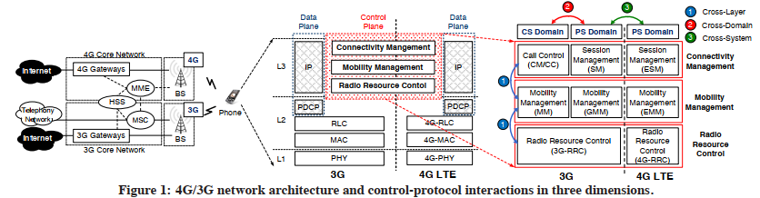
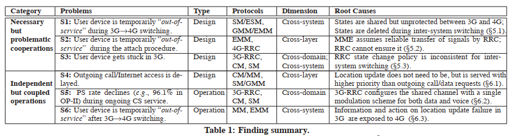
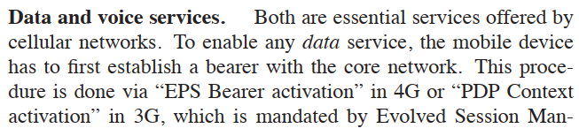
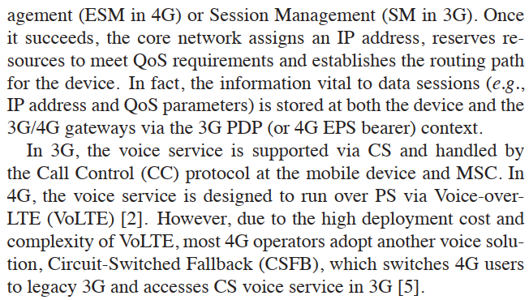
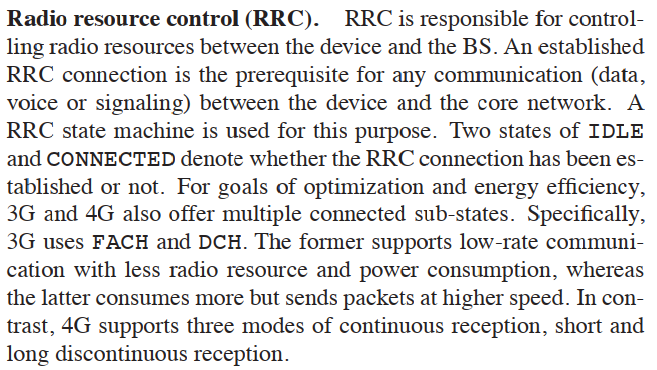
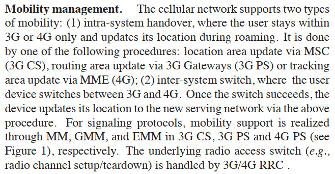
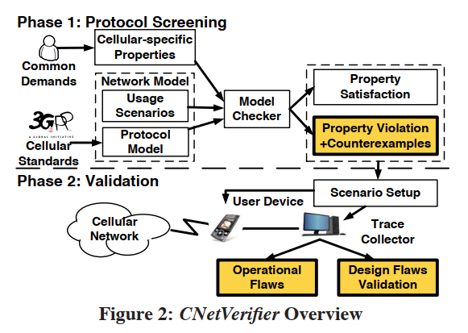
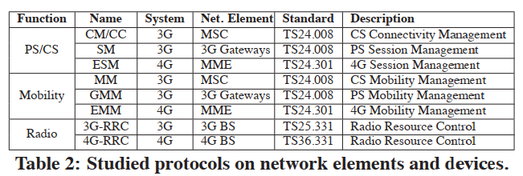
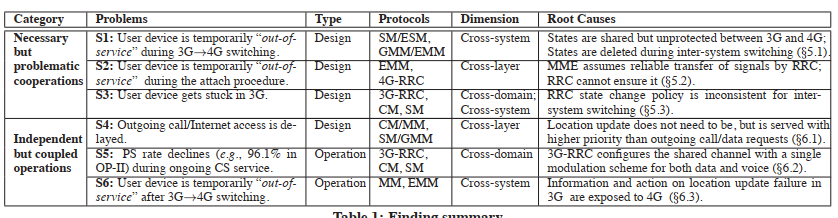

# Control-Plane Protocol Interactions in Cellular Networks

**Guan-Hua Tu, Yuanjie Li, Chunyi Peng, Chi-Yu Li, Hongyi Wang, Songwu Lu**

---

## Summary

* This paper proposes a method to test cellular network control plane protocol interactions. The method consists two phases: the first phase is conducting domain-specific protocol screening, including modeling interactions using finite state machines, defining cellular-oriented properties, checking properties in the state and generating possible counterexamples via standard model checking methods. The counterexamples are implementation and measurement independent. Then in the second phase, the counterexamples are tested on real devices for validation. Though most cellular networks are black-boxes, the system instruments the devices to produce debug traces and compares the results with anticipated outputs. The authors also discuss two kinds of problems: misbehaving protocol interactions and unnecessarily coupled protocol operations. Finally, the authors give some lessons on cross-layer, cross-domain, and cross-system cellular network designs.
* This paper is doing some dirty and arduous work on cellular network verification. Much hard work on building models from 3GPP standards and implementing tracing on devices are hidden between lines. However, the whole process might relies on ad hoc configurations too much, leaving little space for automation. Could there be a data plane verification tool for cellular networks?

## Introduction

* control plane protocols are complex in cellular networks
  * communicate with one another along three dimensions of 
    * cross layers, 
    * cross (circuit-switched and packet-switched) domains, 
    * cross (3G and 4G) systems  
* 
* uncover problems during inter-protocol communications  
  * cellular networks are still closed systems compared with the Internet
  * signaling exchanges are not readily accessible from carriers, nor from devices during normal operations  
  * patterns of inter-protocol communication on the control plane are much richer than their Internet counterparts  
    * between layers of the protocol stack (cross-layer), 
    * between CS (circuit switching) and PS (packet switching) domains (cross-domain), 
    * between 3G and 4G systems (cross-system)
* CNetVerifier
  * model-checking with cellular-specific heuristics
  * instruments the device to collect protocol traces for validation  
  * problematic interactions
    * inter-protocol communications
      * a user device is temporarily out of service because its vital context in 4G is shared but not well protected (being deleted after inter-system switching)  
      * Users are denied network access right after being accepted because higher-layer protocols make unrealistic assumptions on lower layers  
      * 4G users get stuck in 3G because inconsistent policies are used for CS and PS domains in 3G and 4G.  
    * independent operations by protocols
      * outgoing calls are delayed for unjustified location updates because cross-layer actions are “improperly” correlated and prioritized; 
      * PS data sessions suffer from rate reduction (51%-96% drop observed) when traffic in both domains shares the same channel; 
      * User devices are out of service when the failure is propagated to another system  
* 

## Background

* cellular network: base stations + core network
  * BS: radio access to user devices
  * core network: connect BS to wired Internet or public telephony network
* 4G LTE network: PS data service only
  * MME (Mobility Management Entity) to manage user mobility (location update or paging)
  * 4G gateways that route PS packets between the Internet and the 4G BSes
  * HSS (Home Subscriber Server) store user subscription information
* 3G: CS + PS services
  * MSC (Mobile Switch ing Center), which pages and establishes CS services (i.e., voice calls) with mobile devices, 
  * 3G Gateways, which forward PS data packets
  * HSS, which is similar to its counterpart in 4G
* The data plane is responsible for actual data and voice transfer. 
* The control plane provides a variety of signaling functions to facilitate the data-plane operations.
* Major functions
  * Connectivity Management (CM), which is responsible for creating and mandating voice calls and data sessions; 
  * Mobility Management (MM), which provides location update and mobility support for call/data sessions; 
  * Radio Resource Control (RRC), which controls radio resources and helps to route signaling messages
* Major procedures
  * Attach/detach cellular networks
    * 
  * Data and voice services
    * 
    * 
  * Radio resource control (RRC)
    * 
  * Mobility management
    * 

## Methodology

* 
* domain-specific protocol screening
  * explore possible logical design defects in control-plane protocols
    * model-checking techniques
    * produce counterexamples
  * implementation/measurement-independent issues (from 3GPP design standards)
  * model signaling protocol interactions, and define cellular-oriented properties  
    * How to model cellular networks?  
    * Modeling 3G/4G protocol stacks: from 3GPP standards
      * 
      * each cellular protocol as 2 FSMs
        * one running at the user device
        * the other operating in the specific network element (CM/MM, SM/GMM, ESM/EMM at MSC, 3G Gateways & MME)
    * Modeling usage scenarios
      * random sampling  
      * assign each usage scenario with certain probability, and randomly sample all possible usage scenarios  
      * limited options: enumerate
      * unbounded options: run-time signal generator that randomly activates these options at any time  
  * given these inputs, CNetVerifier checks whether a set of desired properties are satisfied  
    * How to define the desired properties?
    * PacketService_OK: Packet data services should be always available once device attached to 3G/4G, unless being explicitly deactivated. 
    * CallService_OK: Call services should also be always available. In particular, each call request should not be rejected or delayed without any explicit user operation (e.g., hanging up at the originating device). 
    * MM_OK: inter-system mobility support should be offered upon request. For example, a 3G↔4G switch request should be served if both 3G/4G are available.  
  * generates a counterexample for each concrete instance of property violation, which indicates a possible design defect  
    * How to check the property given the cellular network model?  
    * model checker creates the entire state space by interleaving all FSMs for each individual protocol  
      * With the constraints of three properties, some states will be marked with “error.”  
    * the depth-first algorithm to explore the state transitions from the initial state (i.e., the device attempting to attach to 3G/4G networks) under various usage scenarios.   
    * Once an error state is hit, a counterexample is generated for the property violation  
    * generates all counterexamples and their violated properties for further experimental validation  
* validation
  * for each counterexample, set up the corresponding experimental scenario and conduct measurements over operational networks for validation
  * measurement dependent
  * identify operational slips / implementation bugs
  * conduct experiments
  * collect protocol traces from real networks
    * main challenge
    * debug info from user devices
      * timestamp of the trace item using the format of hh:mm:ss.ms(millisecond), 
      * trace type (e.g., STATE), 
      * network system (e.g., 3G or 4G), 
      * the module generating the traces (e.g., MM or CM/CC), 
      * the basic trace description (e.g., a call is established)  
    * automatic test tools
  * compare them with the anticipated operations  
* downsides
  * focus on control-plane protocol interactions
  * the defined properties are from the user’s perspective. It may not uncover all issues at base stations and in the core network which operators are interested in.  
  * using random sampling for usage scenarios, some parameter-sensitive defects may not be exposed  
  * due to limited access to cellular networks, some findings may not be validated by experiments  
  * conduct experiments according to those counterexamples reported during the screening phase. Not all operational slips may be identified.  

## Overview of Findings

* necessary yet problematic cooperation: protocol interactions required but misbehave
* independent yet unnecessarily coupled operations: protocol interactions that are not necessary but indeed occur and result in negative impact
* 
* Cross-layer: Protocols in the upper-layer and low-layer directly interact with each other via the interfaces between them  
* Cross-domain: In cross-domain protocol interactions, protocol variants are developed for different domains and indirectly coupled over the common lower-layer protocols  
* Cross-system: Cross-system interactions occur with an 3G↔4G switch  

## Improper Cooperation

## Problematic Coupled Actions

* details omited

