# [Header Space Analysis: Static Checking For Networks](https://www.usenix.org/system/files/conference/nsdi12/nsdi12-final8.pdf)

**Peyman Kazemian, George Varghese, Nick McKeown**

---

[NSDI-slides](https://www.usenix.org/sites/default/files/conference/protected-files/headerspace_nsdi.pdf)

[Cornell-slides](https://www.cs.cornell.edu/conferences/formalnetworks/peyman-slides.pdf)

[code](https://bitbucket.org/peymank/hassel-public/wiki/Home)

## Questions

* Instructions: Write your name and a para or at most two under the following Google Doc

* What is the new problem of slicing and how is it modelled?
  * Slicing is to make sure network are isolated between each other. It's modelled as not overlapped network space
* Why is invertibility and compositionality so crucial and how are they exploited?
  * Invertibility means we can quickly calculate the range inverse and get the parents from current trace easily. Compositionality means we can compose network transfer functions, which is the basis of all computations. 
* Can you intuitively describe the key optimizations and why they are a good idea?
  * IP Table Compression: IP forward table compression
  * Lazy Subtraction: delay expansion of wildcard rules with multiple rules applies with priorities
  * Dead Object Detection: remove empty header space objects
  * Lookup Based Search: Efficient transfer function rule lookup
  * Lazy Transfer Function Evaluation: For orthogonal rules which creates cross-product spaces, delay computation of one set of rules based on commutativity.
  * Bookmarking Applies Transfer Function Rules: Use invertibility to compute source based on trace and applied transfer functions bookmarked.
* What were the most interesting results?
  * The debugging a protocol design is quite interesting since it shows how HSA can model custom, new protocols.
* This paper proposes an idea on modelling the network space as a geometric space of header bits. From this perspective, we can view boxes, links and rules as general network transfer functions and do protocol-agnostic invariant checking (e.g. loop checking, reachability, slice isolation). Since the network is exponentially large, the authors utilize some optimizations algorithmically (IP Table compression, quick rule lookup) and technically (delay execution of wildcard/orthogonal rules) and treat groups of headers as equivalence classes wherever possible. Also, the authors take advantage of Linear Fragmentation assumption to prove a lower algorithmic complexity. Since the technical report or the proof is missing in the Internet, we have no idea how Hassel groups and deals with equivalent classes. Also, the idea is very much like a simulation with symbolic execution.

## Introduction

* multiple protocols/mechanisms simultaneously
  * MPLS
  * NAT
  * ACLs
  * route distribution
* failure can arise from complex interactions of their aggregate
* automatically find important class of failures
* Header Space Analysis (HSA): general protocol-agnostic framework
  * statically check network spec. & configurations to identify an important class of failures
    * Reachability Failures
    * Forwarding Loops
    * Traffic Isolation
    * Leakage
  * entire packet header as concatenation of bits without any associated meaning
    * $\{0, 1\}^L$ space
    * networking boxes transform packets from 1 point to another point or set of points (multicast)
* Hassel: HSA implementation
* switch/router: index into a forwarding table using a destination address, decide where to send the packet next
  * Middleboxes (NAT/firewalls)
  * Encapsulation (VALN/MPLS)
  * escape IP's limitations
    * NAT: address limits
    * MPLS: flexible routing
  * next protocols for specific domains (datacenters, WAN, wireless)
* Simple questions are hard to answer
* help system admin. statically analyze production networks today
* make it easier for system admin to guarantee isolation between sets of hosts/users/traffic
  * secure slicing: no packet from one slice  can be controlled by or read by the other slice
  * VLAN
  * HIPAA rules
* enable static analysis of networks sliced in more general ways
  * FlowVisor: slices  can be defined by any combination of header fields
    * slice: (topology of switchs/links, set of headers on each link, share of link capacity)
    * each slice has its own control plane
    * add complexity to network
  * auto analysis of the network configuration to formally prove that slicing is operating as intended
* Existing tool: protocol-dependent/specialized
* HSA: generalization of geometric approach to packet classification
  * classification rules over `K` packet fields are viewed as subspaces in a `K` dimensional space
  * each packet: `{0, 1}^L` space
  * model all router/middlebox processing as box transfer functions: subspace of `L`-dimensional space `=>` other subspace (packet/flow is modified as it travels by composing the transfer functions along the path)
    * 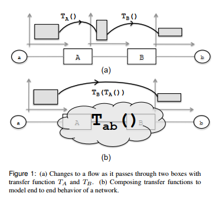
    * model a network of boxes
      * network transfer function $\Phi$
        * combines all individual box functions into one giant function
      * topology transfer function $\Gamma$
        * models the links that connect ports together

## The Geometric Model

* Header Space $\mathcal{H}$
  * basic building blocks: wildcard expressions objects (0, 1, `x`)
    * a hypercube in $\mathcal{H}$
    * [[N: like Hardware 3-state signal (]]
  * region/flow: union of wildcard expressions
* Network Space $\mathcal{N}$
  * switches: set of boxes
  * ports: external interfaces each with a unique identifier $\mathcal{S}$
  * packet traversing on a link `->` point in $\{0, 1\}^L \times \{1, \cdots, P\}$ space
* Network Transfer Function $\Phi()$
  * node as transfer function: $T(h, p): (h, p) \to \{(h_1, p_1), \cdots, (h_n, p_n)\}$
  * 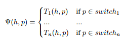
* Topology Transfer Function $\Gamma()$
  * 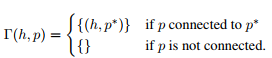
  * unidirectional function
* Multihop Packet Traversal
  * `k`-hop: $\Phi^k(h, p)$
* Slice: $S$ defined as (slice network space, permission, slice transfer function)
  * slice network space: subset of network space controlled by the slice
  * permission: subset of `{read(r), write(w)}·`
  * slice transfer function $\Phi_s(h, p)$: capture the behavior of all rules installed by the control plane of slice `S`
  * implicit slicing: protocol coexists today on the same network using protocol IDs/network partitioned using VLAN IDs.
  * explicit slicing: FlowVisor in OpenFlow

## Modeling Networking Boxes

* helper functions
  * `protocol_field()`: particular field in a particular protocol
    * `ip_src(h)`: source IP address bits of header `h`
  * `R(h, fields, values)`: rewrite the `fields` in `h` with `values`
    * `R(h, mac_dst(), d)`: rewrite the MAC destination address to `d`
    * can be represented by a masking AND following by a rewrite OR
* modeling an IPv4 router processes packets as follows
  * rewrite src/dst MAC address
  * decrement TTL
  * update chyecksum
  * forward to outgoing port
  * `T{ipv4}(.) = T{fwd} . T{chksum} . T{ttl} . T{mac}`
  * `T{fwd}(h, p) = {(h, ip_lookup(ip_dst(h)))}`
  * `T{mac}`: lookup the next hop MAC address, update src/dst MAC address
  * `T{ttl}`: drop the packet if `ip_ttl(h) = 0`, otherwise `R(h, ip_ttl(), ip_ttl(h) - 1)`
  * `T{chksum}`: update the IP checksum
  * 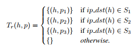'
* Firewall
  * transfer function that extract IP/TCP headers
  * match headers against a seq. of wildcard expressions (model ACL rules)
  * drop/forward the packet as specified by the matching rule
* Tunneling end point: shift operator that shifts the payload packet to the right & a rewrite operator that rewrites the beginning of the header
* Network Address Translator (NAT): rewrite operator

## Header Space Algebra

* Set operations on $\mathcal{H}$
  * Intersection
    * 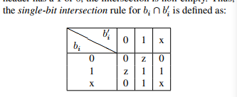
    * [[N: exact bit operation in HDL...]]
    * `z`: empty intersection / annihilator
  * Union
    * in general cannot be simplified
    * some are equivalent to boolean expression `=>` Karnaugh-Maps/Quine-McCluskey
  * Complementation
    * the union of all headers that do not intersect with `h`
    * 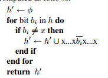
  * Difference: intersection + complementation $A - B = A \cap B$
    * 
* Domain: domain of a transfer function is the set of possible (header, port) pairs that the transfer function accepts
* Range: range of transfer function is the set of all possible (header, port) that transfer function can output after applying all possible inputs on every port
* Range Inverse: reachability/loop detection computation requires working backwards from a range to  determine what input could have produced it. $X = T^{-1}(S)$

## Using Header Space Analysis

* Reachability Analysis

  * consider the space of all headers leaving the source, then track this space as it's transformed by each successive networking box along the path to the destination
  * if no head space at the dest. remains, cannot communication ([[N: basically DFS/BFS]])
  * $R_{a\to b} = \bigcup_{a \to b \mathtt{paths}} \{T_n(\Gamma(\cdots(\Gamma(T_1(h, p)))\cdots)\}$
    * where the switches in each path are denoted by $a \to S_1 \to \cdots \to S_n \to b$
  * 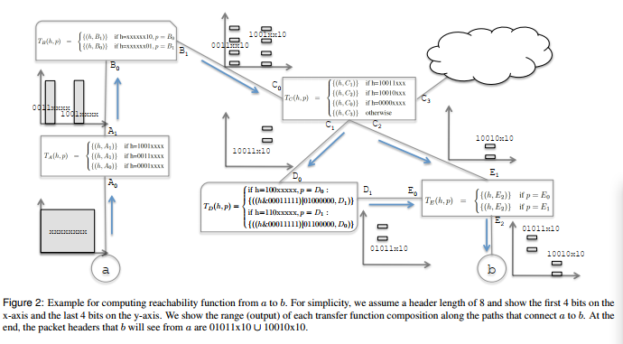
  * complexity: $O(R_1R_2)$ where headerspace consists of union of $R_1$ wildcard expressions & transfer function has $R_2$ rules
    * **Linear Fragmentation** assumption
      * each of the input wildcard expressions will match only a few rules in the transfer
        function and generate at most $cR$ (and not $R^2$)  
      * production: the match patterns of forwarding rules will become less specific
      * most flow division happens as a result of rules that are filtering out some part of input flow (ACL rules)
      * then the running time is $O(dR^2)$ where `d` is the network diameter (maximum number of hubs that a packet will go through before reaching destination), `R` the maximum number of forwarding rules in a router
    * algorithmic leverage: treating groups of headers as an equivalence class wherever possible

* Loop Detection

  * loop: packet returns to a port it has visited earlier

  * Generic Loops

    * injecting an all-`x` test packet header from each port & track the packet until
      * It leaves the network;
      * It returns to a port already visited (`P{ret}`); `=>` don't report, avoid reporting same  loop twice
      * It returns to the port it was injected from (`P{inj}`) `=>` report a loop
    * BFS on propagation path
    * 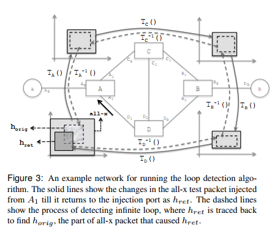
    * 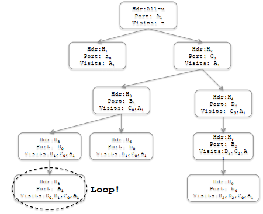
    * `Hdr`: set of packet headers
    * `Port`: reached port
    * `Vistis`: port path
    * Loop: `Port` is the first element of `Visits`
    * Similar structure with reachability test
    * Complexity: $O(dPR^2)$ under Linear Fragmentation assumption

  * Single Infinite Loops (subset of generic loops where packets loop indefinitely, packet with TTL loop finitely)

    * 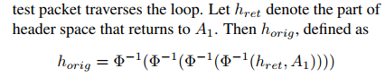

    * $h_{ret} \cap h_{orig} = \emptyset$: finite loop, because the header space caused the loop does not intersect with the returned header space

    * $h_{ret} \subseteq h_{orig}$: infinite, every packet header in $h_{orig}$ is mapped by the transfer function of the loop to a point in $h_{ret}$, the process will repeat in the next round

    * Neither: iterate again on $h_{ret} := h_{ret} \cap h_{orig}$ and recompute $h_{orig}$ until first two cases happens (must terminate in at most 2^L steps, because $h_{ret}$ shrinks)

      * e.g. IP TTL

    * > More tortuous loops, where a packet passes through other loops before coming back to a first loop, can also be detected using a simple generalization  
    
      * [[Q: the technical report is invalid...]]

* Slice Isolation

  * help create new isolated slices
    * identification of a region of network space that does not overlap with regions belonging to existing slices
    * $N_a = \{[(a_i, p_i)]_{p_i \in S}\}， N_b = \{[(b_i, p_i)]_{p_i \in S}\}$, $a, b$ are headers
    * $a_i \cap b_i = \emptyset$ for all `i` [[Q: should be $a_i \cap b_j$?]]
    * $N_a \cap N_b = \{[(a_i \cap b_i, p_i)]_{p_i \in N_a, N_b}\}$
    * [[N: how to map slices to network spaces?]]
  * detect when slices are leaking traffic
    * Therefore on each switch-port, we apply the network transfer function of slice a to its header space reservation, to generate all possible packet headers from slice `a`  `=>` output header set overlaps with other slice `=>` potential for leaks
    *  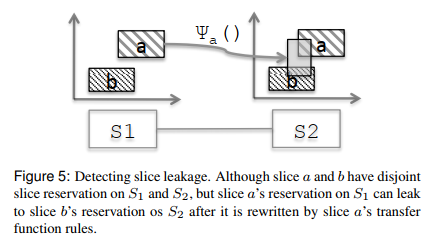
  * complexity: $O(W^2N)$, `W` is the maximum number of wildcard expressions used to describe any slice's reservation. `N`: the number of slices

## Implementation

* 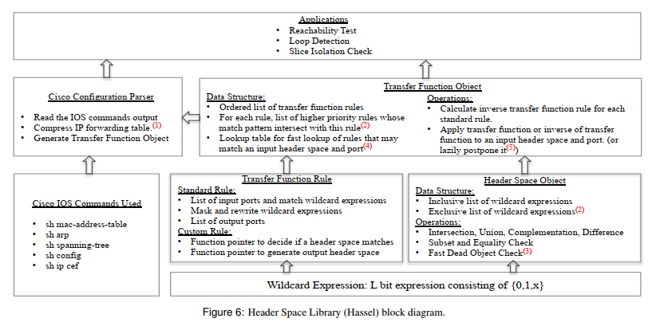
* Optimizations
  * IP Table Compression
    * IP forwarding table compression techniques to reduce the number of
      transfer function rules  
  * Lazy Subtraction
    * extended the notion of a header space object to accept a union of wildcard expressions minus a union of wildcard expressions $\cup\{w_i\} - \cup\{w_j\}$
    * delay the expansion of terms during intermediate steps
  * Dead Object Deletion
    * empty header space objects should be removed
  * Lookup Based Search
    * avoid inefficient linear search via a lookup table that returns all wildcard rules that may intersect with the search key
  * Lazy Evaluation of Transfer Function Rules`
    * may have `D` destinations & `S` srcs cross-products
    * if orthogonal `=>` use commutativity of transfer functions to delay computation of one set of rules until the end
  * Bookmarking Applied Transfer Function Rules
    * memorize the specific transfer rules applied to a header space object along the forward path `=>` save time during reverse path computation
  * [[N: use Spark for such computation? Parallel?]]
* Debug new protocols

## Limitations

* root cause of inconsistency
* whether routing is efficient/meeting objectives?
* HSA can behave like 
  * post-layout verification tools in chip-design
  * static analysis checkers in compilation
  * check the low level output against a set of universal invariants, without understanding the intent/aspirations of the protocol designer
* How/Why forwarding table entries are inserted, how they will be evolved as the box receives future message
* cannot deal well with churn in the network, only detect problems that persist longer than the sampling period

## Conclusion

* HSA: general framework for reasoning about arbitrary protocols
  * find common failures
  * parsing routing/configuration table automatically
* geometric model for better slicing `=>` network transfer function analysis `=>` for given violation, surprisingly easy expressed using high level abstraction `=>` element expr/impl.
* perf. optimizastion
* 

