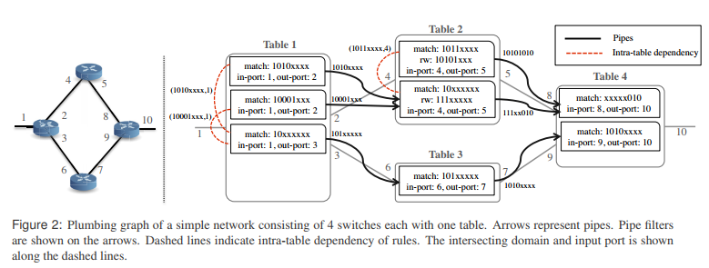
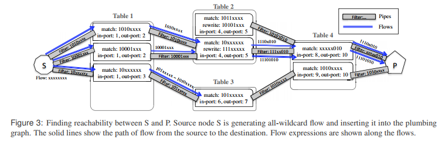
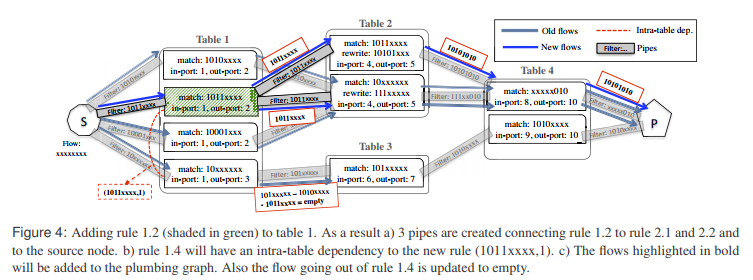
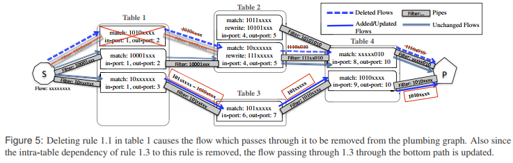
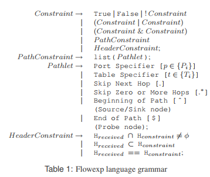
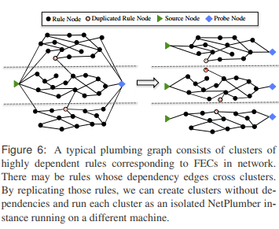

# Real	Time	Network	Policy	Checking Using	Header	Space	Analysis

**Michael Chang, Hongyi Zeng, George Varghese, Nick McKeown, Scott Whyte**

---

## Summary

* In this paper, the authors propose a tool, NetPlumber, providing real time network invariant checking. NetPlumber is based on HSA and works specifically well in SDNs (since SDN provides a central view of the network). The core of NetPlumber is an updating plumbing graph which describes the next hop dependencies between router rules. To test an invariant, the users should write their policy in Flowexp DSL, and then insert probing/source/sink nodes in the network. These nodes invoke the simulation on the network (much like a symbolic execution since it injects all-x` headers at sources). Based on the Linear Fragmentation Assumption, the execution will be fast. In the last sections, the authors also present a distributed version of NetPlumber based on sharding on dependency clusters.
* This paper is a natural extension to Header Space Analysis since it provides two essential things, plumbing graph for modelling network and Flowexp DSL for modelling invariants. Two observations , Linear Fragmentation Assumption and Cluster Dependency, are interesting and may require further investigation. Meanwhile, this tool requires a central view, which may not be convenient to implement on a conventional network.

## Introduction

* Network state may change rapidly, but must ensure correctness
* Existing policy checkers cannot verify compliance in real time
  * need to collect "state" from entire network
  * need time to analyze this state
* SDN provides opportunities by providing a logically centralized view from which every proposed change can be checked for compliance with policy
* NetPlumber based on NSA on SDN/conventional network
  * incrementally checks for compliance of state changes
  * maintain a dependency graph between rules
  * abstract intermediate form
  * SDN: control plane, observe state changes (e.g. OpenFlow messages) between control plane & switches
    * events including CURD of rules, port/swtich up,down
    * set of invariants
  * conventional network: SNMP traps/polling switches
* several entities can modify the forwarding rules
  * manual configuration
  * distributed protocols (OSPF, spanning tree, BGP)
* no single location where all of the state is observable or controllable
  * ad-hoc tools: ping, traceroute
* Software-defined Networks (SDN)
  * separate control plane from the forwarding plane
  * OpenFlow writes `<match, action>` to switches
    * The controller controls the forwarding state because it decides which rules to write to the switches 
    * The controller observes the forwarding state because it was the sole creator.  
* Policy formal language (similar to FML)
* 
* Contributions
  * NetPlumber
  * Flexible Policy Query Mechanism
  * Distributed NetPlumber
  * Evaluation

## Header Space Analysis

* [[N: check [HSA](./header_space.md)]]

## NetPlumber

* plumbing graph: captures all possible paths of flows through the network

  * 
  * nodes: rules
    * `<match, action>`
    * action: forward (drop as special case), rewrite, encapsulate, decapsulate
  * directed edges/pipes: next hop dependency
    * physical link from rule A's box to rule B's box and
    * domain of rule B has an intersection with range of rule A
    * intra-table dependency: for priorities, each rule node keeps track of higher priority rules in the same table. The node calculates the domain of each higher priority rule, subtracting it from its own domain
      * [[Q: How? Do we add edges for different rules in the same table?]]
      * [[N: just subtract the inputs from higher priority nodes lazily]]
  * Initialization
    * examining current forward table
    * compute reachability by computing the set of packets from source port `s` that can reach destination port `d` by injecting an all-wildcard flow (all-x packet), propagating it along the edges of the plumbing graph
      * flow filtered by `match` and transformed by `action`

  * Operation 
    * add/remove nodes, update routing of flows
    * re-run policy checkers
  * Source/Sink Nodes: insert/absorb flows
    * 
  * Probe Node: check policy/invariants
    * attached to plumbing graph
    * check path/header of received flows
    * source/sink probing
  * Update
    * Adding new rules
      * create pipes from new rule to all potential next hop rules & from all potential previous hop rules to the new rule
      * intra table dependency also
      * update the routing of flows, ask all previous hop nodes to pass their flows on the newly created pipes
        * intra-dependency `=>` update flow passed through lower priority nodes by subtracting domains intersection with higher priority flows
      * 
      * complexity: $O(r + spd)$
        * `r`: number of entries in each table
          * find intra-table dependency
          * creating new pipes by doing $O(r)$ intersections of the range of the new rule with the domain of rules in the neighboring tables
        * `s`: number of souce/sink nodes attached to the plumbing graph
        * `p`: number of pipes to/from the rule
        * `d`: diameter of the network
        * $O(s)$ flow on each of these previous nodes
        * pass the flow through $O(p)$ pipes
          * Linear fragmentation argument: $O(s)$ flows that will survive this transformation through pipes
        * maximum path length $d$
    * Deleting rules
      * 
      * remove flows, update intra-dependency nodes
    * Link Up
      * create new pipes (because of physical link condition)
    * Link Down
      * all pipes created on that link is deleted
    * Adding new tables: no change until new rules added
    * Deleting Tables: deleting all rules

## Checking Policies & Invariants

* probe node with `filter` flow expression & `test` flow expression
  * `filter`: constrains set of flows examined
  * `test`: constraints that is checked
  * `existential`: fire if none of the flows examined by the probe satisfy the test flowexp
  * `universal`: vice versa
* `Flowexp` Language
  * 
  * flow in plumbing graph carries its complete history: pointer to the corresponding flow at the previous hop
    * [[Q: persistent data structures? RDD?]]
  * `PathConstraint`: specify constraints on the path taken by a flow
    * ordered list of pathlets
    * `S -> A -> B -> C -> P`, `^(p = A) && (p = A) . (p = C)`
  * `HeaderConstraint`: check if the received header has any intersection/subset/equal
* Checking loops/black holes: by default checking its history `=>` loop-detected/non-drop-rule cannot pass through any pipes emanating from `R`
  * [[N: It's like symbolic execution!]]
* Checking Reachability Policies
  * Basic Reachability Policy: `S` port should not be reachable from guest machine ports `{G1, ..., Gk}`
    * source probe: place source node & generate wildcard flow at each of the guest ports `=>` place a source universal probe node on port `S` 
      * `forall f: f.path ~ ![^(p  in {G1, ..., Gk})]`
    * dual solution using sink probe
  * Reachability via a Waypoint: ensure all traffic from port `C` to port `S` must pass through a way point node `M`
    * source node at `C`, generate wildcard flow, probe node `S`
    * `{forall f | f.path ~ [^(p in {C})]}: f.path ~ [^.*(t=M)]`
      * filter flows originate from `C`
      * verifies they pass through the waypoint `M`
  * Path length constraint: ensure no flow from port `C` to port `S` should go through more than 3 switches
    * probe at `S`, source node at `C`
    * `{forall f | f.path ~ [^(p in {C})]}: f.path ~ [^.$ | ^..$ | ^...$ ]`
  * checking something at the destination regardless of where the traffic comes from: using sink node is more efficient
    * Using source probes would require placing one source probe at every potential source. This can be computationally expensive as the run time of NetPlumber grows linearly with number of source or sink nodes.  
  * checking a condition for a particular source: using source node
  * [[N: reachability is just satisfiability in SAT solver! `f.path` is SAT constraints]]
* Policy translator: `Flowexp(C++) <=> FML(Prolog)`

## Distributed NetPlumber

* 
* memory-intensive
* parallel-on-switches: address memory bottleneck, but don't need performance as instances depend on each other
* clusters of highly dependent rules with few rules between different clusters
  * forwarding equivalence classes (FECs) that are routed end-to-end in the network with possible aggregation
* parallel-on-clusters
  * replicate rules belonging to 1+ clusters
  * probe nodes replicated on all instances for global verification
  * running time $O(m_{avg}(r/n+spd/m))$
  * how to clustering? IP network natural cluster heuristically
    * [[Q: what about other networks? IPFS?]]
    * for 1 subnet, create 2 for subset & rest
    * divide subnet into 2 clusters based on first non-mask bit
      * divide until 2 cluster are roughly the same size
      * recursively

## Discussion

* Conventional Networks: implementing notification mechanism for getting updated state information (SNMP)
* Handling Transient Violation
  * black hole accepted while installing a path in a network
  * should be turned off
* Handling Dynamic Policies
  * change dynamically upon VM migration in multi-tenant data centers
  * attach source node to every edge port, update policies by changing the locations & test conditions of probe nodes
* Limitations
  * cannot model middleboxes with dynamic state
  * greater processing time for verifying link updates
  * 

