# A General Approach to Network Configuration Verification‎

**Ryan Beckett, Aarti Gupta, Ratul Mahajan, David Walker**

---

## Summary

* This paper presents Minesweeper, a implementation of scalable and general control plane configuration verification. Control plane verification is hard because the protocols differs with many attributes and packets may interfere with each other based on protocol configurations. Minesweeper addresses the problems by introducing graph based model with constraints on its edges and nodes  instead of path based analysis, and combinational search (feed network semantic model and properties formulas to symbolic model checker simultaneously) instead of computing message sets step by step. To scale the implementation, Minesweeper also introduces hoisting and slicing optimizations on its logical formulas. Hoisting optimizations lifts the common computations (from two symbolic prefix matching to range checking and forgo modeling loops for default settings). Slicing optimization eliminates the symbolic variables as many as possible. The authors shows various kinds of protocols and invariants can be encoded inside the graph systems using many attributes.
* The advantages of Minesweeper originates from the whole analysis of all network components (other systems are incremental - since they computes messages sets from router to router along a path). Since Minesweeper takes advantage of the Z3 SMT solver, it only produces one counterexample at one time. I'm a bit confused at the process of prefix elimination, but since both NoD and Minesweeper leverages the Z3 SMT solver, could the difference of cube and select-join optimization also apply for Minesweeper? Also, could the approach in ERA (succinct control plane information representation) be applied here to eliminate symbolic variables?

## Introduction

* Minesweeper: network configurations `=>` logical formula + constraints `=>` satisfiable?
* network configuration analysis tools
  * network design coverage: types of network topologies, routing protocols and other features the tool supports
  * data plane coverage: how many of the possible data planes the tool can analyze
  * 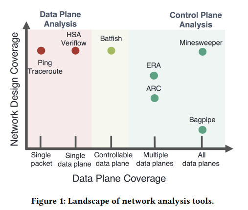
* Minesweeper way to address scalability
  * Graphs (not paths)
    * in stateless data planes, packets on one path never interfere with those on a different path; but in the control plane, two route announcements can interfere  
    * A routing message along one path may be less preferred than a message over another path, causing it to be dropped when the other message is present  
    * interactions along all paths must be modeled `=>` intractably large number of paths
    * graph-based model + rich logical constraints on its edges & nodes encode all possible interactions of route messages
    * reason about equivalence of routers, load balancing, disjointedness of routing paths, and if multiple paths to the same destination have equal lengths  
  * Combinational search (not message set computation)
    * do not eagerly compute the sets of routing messages that can reach various points in the network
    * Rather than iteratively computing sets of messages, one can instead ask for a satisfying assignment to a logical formula that represents all possible message interactions  
      * from symbolic model checking community
    * model checking with message set computation is PSPACE-complete  
    * searching for a satisfying assignment in the related bounded model checking problem is NP-complete
    * `x{m, l}`: whether a message m reaches a location l in the network  
    * `N`: network semantics logically
    * `N ^ x{m, l} = true`
  * Stable paths problem  
    * convert the distributed message-passing of the control plane into an equivalent logical formula  
    * encode the corresponding set of edge constraints in our formula, such that satisfiable assignments correspond to stable paths in the control plane  
  * Slicing & hoisting optimizations
    * slicing, which analyzes the formula to remove variables and constraints that cannot affect the final outcome 
    * hoisting, which lifts repeated computations out of their logical context and precomputes them once  
    * effective because real networks have simpler control planes than the theoretical worst case  

## Motivation

* 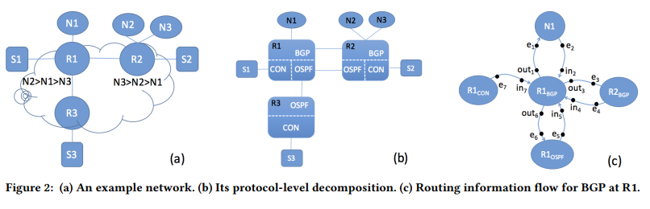
* 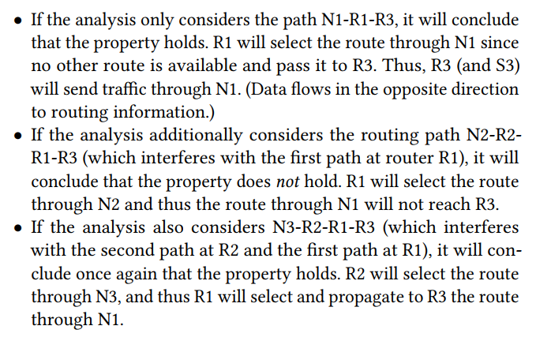

## Basic Network Model

* `F`: a system of SMT constraints defines as the conjunction `N` (behavior of the network given the current configurations of all routers) and `-P` (negated property)
* 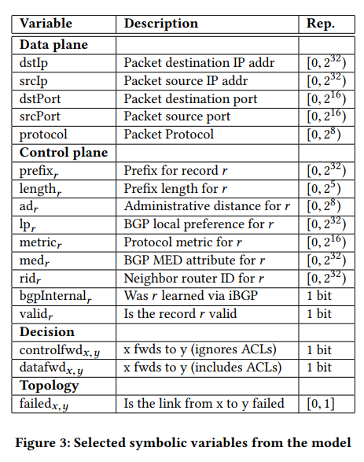
* Modeling data plane packets: symbolic data packets
* Modeling protocol interactions: model control plane protocols and how they decide to forward packets
* Encoding control plane information: symbolic control plane records
  * Announcements for that prefix are annotated with the administrative distance (ad)  
  * local preference (lp) for BGP
  * metric is a protocol-specific measure of the quality of the route  
  * router id (rid) is used to break ties among equally-good routes  
  * BGP multi-exit discriminator (med), 
  * whether a BGP route was learned via iBGP (bgpInternal)  
  * every record contains one special boolean field, called valid. If valid is true, then a message is present and the remaining contents of the record are meaningful (messages arrives at this location)
  * `e.valid = FBM(e.prefix, dstIP, e.length)`
  * `FBM` (first bits match) tests for equality of the first `e.length` bits of the prefix and destination IP (prefix-based forwarding semantics)
    * tricky to encode efficiently
* Encoding import filters
  * 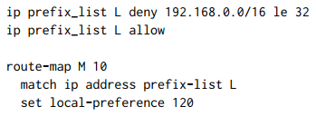
  * 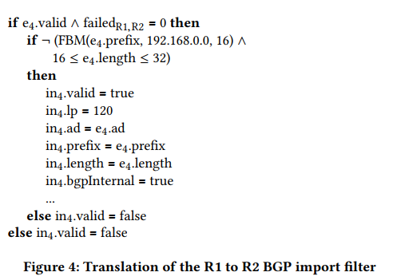
* Encoding route selection
  * `best{prot}`: for each protocol
  * `best{overall}`: best among all protocols
  * `controlfwd{x, y}`: for each edge in the network between routers `x` & `y`, indicates that router x decides to forward traffic for the destination to router y  
    * `controlfwd{R1, R2} = (e4.valid ^ e4 = best{overall})`
* Encoding route export
  * 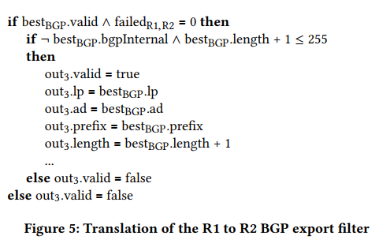
  * After selecting a best route, each protocol will export messages to each of its peers after potentially processing these messages through peer-specific export filters  
  * the export constraint will connect the record for the protocol’s best route (bestBGP) with a record on an outgoing edge of a router  
  * the route export constraint accounts for the fact that iBGP routes should not be re-exported to other iBGP peers by checking if the best route was learned via iBGP  
  * the path metric is updated according to the protocol   
  * the route is only exported if the new path metric does not overflow the maximum protocol path length   
* Encoding data plane constraints
  * the actual data plane forwarding behavior can differ due to the presence of an access control list (ACL) 
  *  For each variable `controlfwd{x,y}`, we create a corresponding `datafwd{x,y}` variable 
    *  represent the final data plane forwarding behavior of the network  
  * 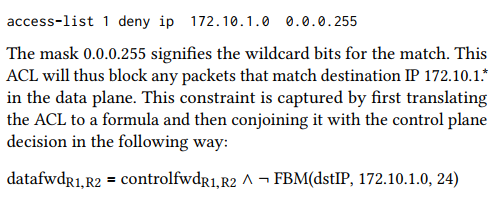
* Encoding properties
  * 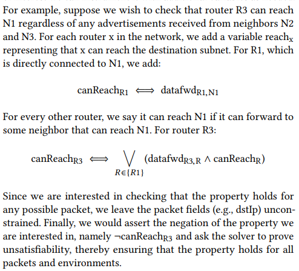

## Generalizing the Model

* Link-state protocols
  * OSPF, ISIS
  * routers share information about the cost and state (up or down) of each link
  * Each router then builds a global view of the network and computes the least-cost path to each destination    
  * Each router along the shortest path will send traffic to a neighbor only if that neighbor has a path to the destination and no other neighbor offers a lower cost path
  * model link-state protocols as path-vector protocols
* Distance-vector protocols
  * RIP
  * passing information about path length to the destination between neighbors  
  * model the solution to a distance vector protocol the same way as for link-state protocols but where each link has a weight of 1  
* Static routes
  * own routing instance that makes forwarding decisions based on the destination IP address  
* Aggregation
  * routers announce a less-specific prefix that covers many, more-specific prefixes, helps reduce the size of the routing tables  
  * as a modification to the prefix length attribute  `/24 -> /16`
* Multipath routing
  * relax the best route comparison so that it does not compare the router ID  
  * any route as good as the best route will be used  
* BGP communities
  * BGP communities are strings that can be attached to (or removed from) route advertisements  
  * `community{x, c}` for each router `x` & community `c` that appears in some router's configuration
* iBGP
  * cross-destination dependencies through recursive lookup  
  * In order to determine the forwarding behavior for a particular packet p over a network using iBGP, one first has to determine the forwarding behavior for each user-defined next-hop destination IP address configured between iBGP peers  
  * `N` additional copies of entwork where `N` is the number of routers configured to run iBGP
  * Each copy of the network encodes the forwarding behavior for a packet destined to the next-hop IP address associated with one of the iBGP-configured routers  
  * add the constraint that router A only propagates routes to router B over an iBGP connection if A can reach B in the network copy corresponding to B’s configured nexthop destination IP address
  * `bgpInternal`:   whether or not a route was learned from an iBGP peer  
  * Routes learned via iBGP are allowed to be exported to eBGP peers but not to other iBGP peers  
* Route reflectors
  * 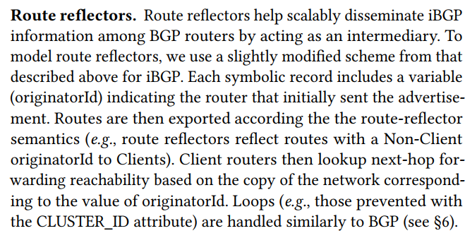
* Multi-exit discriminator (MED)
  * 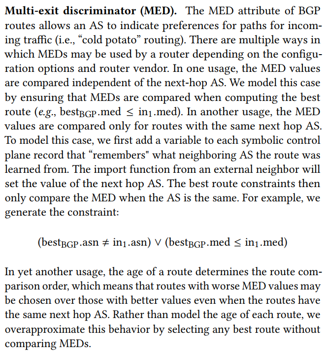
  * 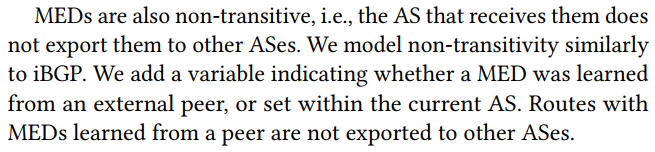
* Design Decisions & Limitations
  * only describes stable solutions
  * only consider elements of the control plane that influence the forwarding decisions pertaining to a single symbolic packet at a time  
    * more expensive to model a few features that introduce dependencies among destinations  
    * must create a separate copy of every control plane variable to determine the forwarding for a second packet corresponding to the next hop address  
    * modeling iBGP requires one additional copy of every control plane variable for every router configured with iBGP  

## Properties

* Reachability
  * 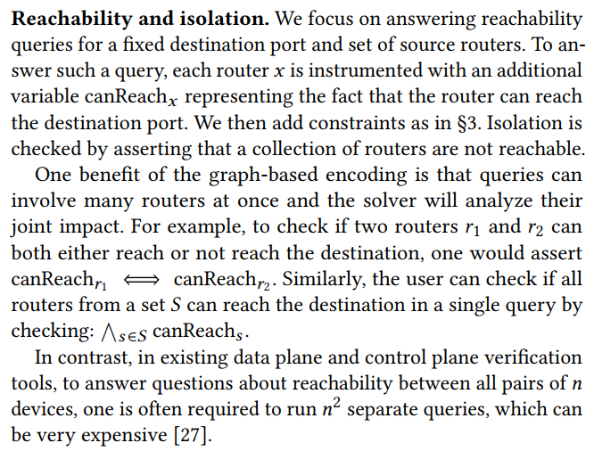
* Waypointing
  * 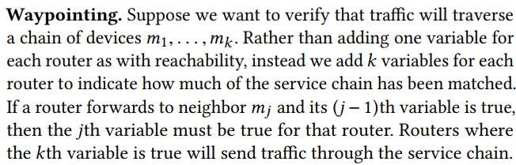
* Bounded or equal path length
  * 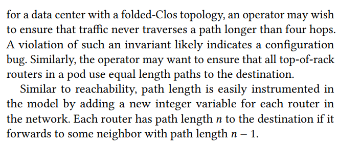
* Disjoint paths
  * 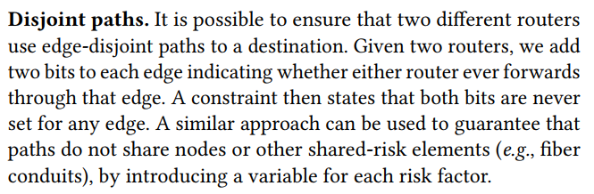
* Forwarding loops
  * 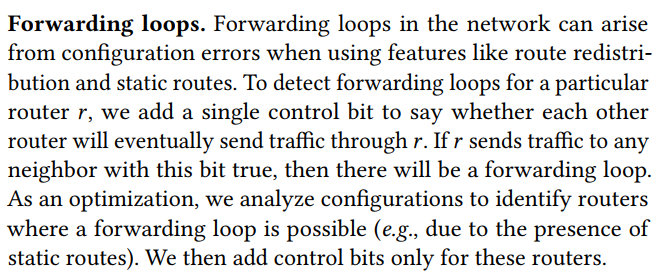
* Black holes
  * 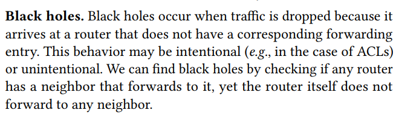
* Multipath consistency
  * 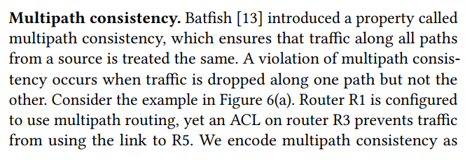
  * 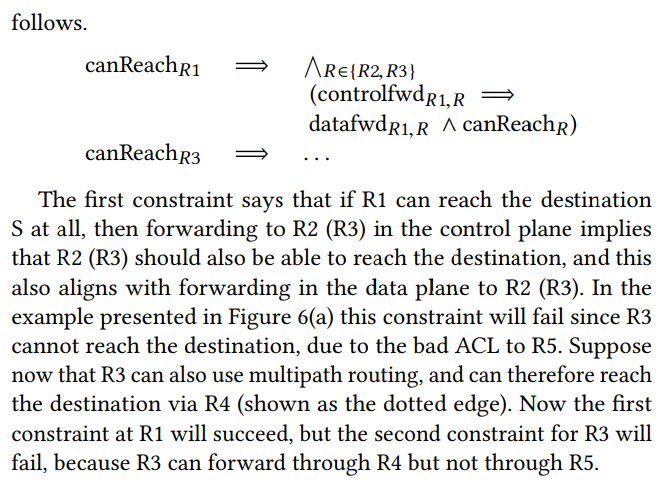
* Neighbor or path preferences
  * 
* Load balancing
  * 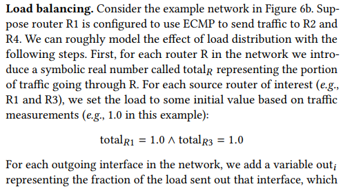
  * 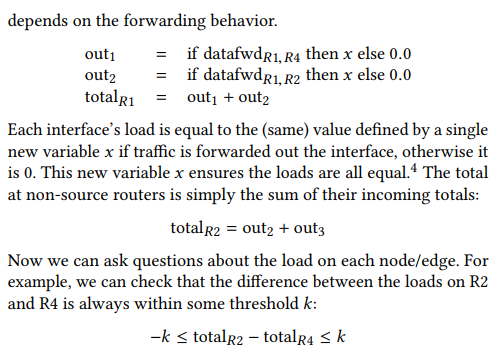
* Aggregation & leaking prefixes
  * 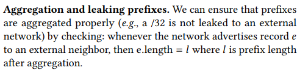
* Local equivalence
  * 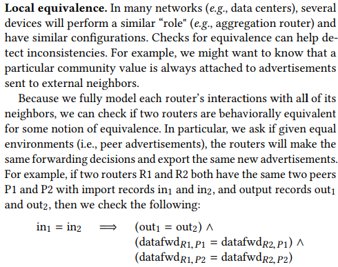
* Full equivalence
  * 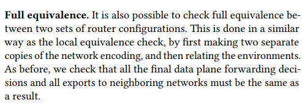
* Fault tolerance
  * 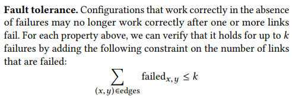
  * 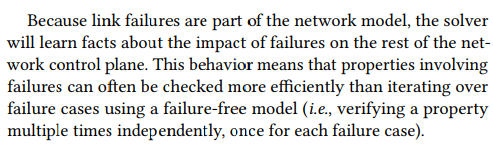
* Fault-invariance testing
  * 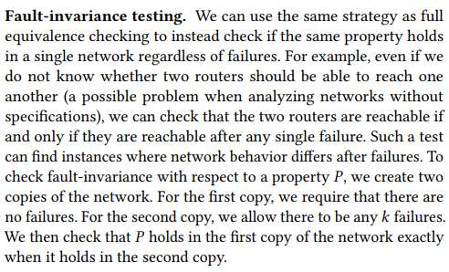

## Optimizations

* Hoisting
  * Prefix elimination
    * `FBM(p1, p2, n)` checking 2 symbolic values... bitvectors are expensive
    * In particular, because we know (symbolically) the destination IP address of the packet and the prefix length, there is a unique valid  
    * safely replace any filter on the destination prefix with a test on the destination IP address directly, thereby avoiding the need to explicitly model prefixes.  
    * `ip prefix_list L allow 192.168.0.0/16 ge 24 le 32`
    * 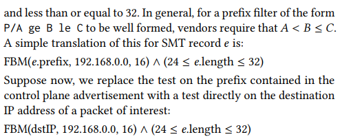
    * 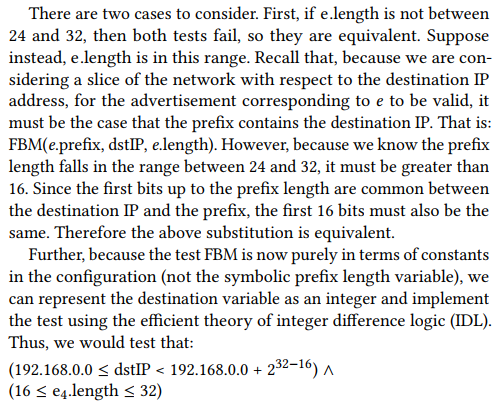
  * Loop detection
    * BGP tracks the ASNs (autonomous system numbers) of networks along the advertised path and routers reject paths with their own ASN  
    * if maintaining, for each BGP router, a control bit saying whether or not the advertised
      path already went through that router  `=>` grows with the square of the \# of the routers
    * any BGP router that uses only default local preferences (i.e., only makes decisions based on path length) will never select a route where it is already part of the AS path
      * path containing the loop is strictly longer than the path without the loop  
      * BGP local preferences for external neighbors and for iBGP peers will not create loops  
* Network slicing
  * Remove symbolic variables that never influence the decision process  
  * Keep a single copy of import and export variables for an edge when there is no import filter on the edge  
  * Keep a single, merged copy of the export record for a protocol when there is no peer-specific export policy.
  * Do not model directly connected routes for a router whose interface addresses can never overlap with the destination IP range of interest to the query.
  * Merge the data plane and control plane forwarding variables along edges that do not have ACLs.
  * Merge per-protocol and overall best records when there is only a single protocol running on a router  

## Implementation

* `Batfish` parser `=>` symbolic model
* Z3 SMT solver (integer difference logic + preprocessors)