# Detecting BGP Configuration Faults with Static Analysis‎

**Nick Feamster, Hari Balakrishnan**

---

## Summary

* This paper presents, rcc, a static analyzer tool for detecting (single AS) BGP configuration faults before deploying. rcc first preprocesses and parses the configurations into a normalized representation (in SQL tables). rcc then checks the constraints via SQL queries and analyzes the results to generate faults (may have false positive/negatives). rcc mainly checks two kinds of faults: path visibility faults (every router that has a usable path to a destination learns at least one valid route) and route validity faults (every route learned by a router describes a usable path, and that this path corresponds to the actual path taken by packets sent to the destination). Path visibility faults can be resulted from misconfigured route reflectors and detected by rcc using reflector-client relationship graphs. Route validity faults may originate from unbalanced routers to the same peer or internal BGP signaling partition. rcc detects possible route validity faults by finding some violations of best practices. 
* This paper is interesting as it leverages some common practice in BGP and statically analyze the configurations quickly and scalably. I wonder if someone ever uses sound methods (like lattice analysis, abstract interpretation) to analyze the methods and if they scale well.

## Introduction

* Internet: many independent autonomous systems (AS-es) exchanging reachability information using BGP
* `rcc`: check router configuration using static analysis
  * route validity faults (routers may learn routes not corresponding to usable paths)
    * routers attempt to send data packets via these routes, then packets will ultimately reach their intended destinations  
  * path visibility faults (routers may fail to learn routes for paths that exist in the network)
    * Path visibility says that BGP will correctly propagate routes for existing, usable IP-layer paths
    * control path is propagating BGP routes correctly  
  * steady state
* detecting BGP configuration faults is difficult
  * defining a correctness specification for BGP is difficult: 
    * its many modes of operation and myriad tunable parameters permit a great deal of flexibility in both the design of a network and in how that design is implemented in the configuration itself
  * high-level correctness specification must be used to derive a set of constraints that can be tested against the actual configuration  
  * BGP configuration is distributed
    * analyzing how a network configuration behaves requires both synthesizing distributed configuration fragments and representing the configuration in a form that makes it easy to test constraints
* fault causes
  * the mechanisms for propagating routes within a network are overly complex  
  * many configuration faults arise because configuration is distributed across routers  
  * configuring policy often involves low-level mechanisms (e.g., “route maps”, “community lists”, etc.) that should be hidden from network operators  

## Background & Motivation

* BGP attributes
  * `destination prefix` associated with the route  
  * `AS path`, the sequence of ASes that advertised the route  
  * `next-hop`, the IP address that the router should forward packets to in order to use the route  
  * `multi-exit discriminator (MED)`, which a neighboring AS can use to specify that one route should be more (or less) preferred than routes advertised at other routers in that AS  
  * `community value`, which is a way of labeling a route
*   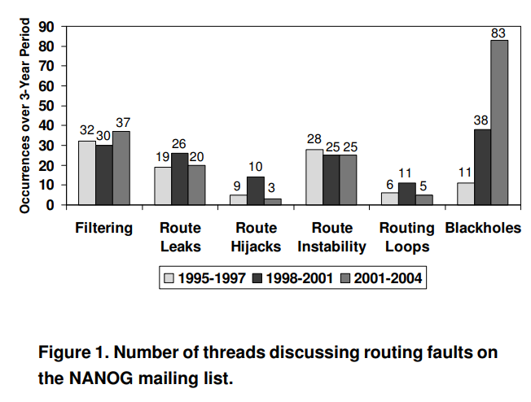

## `rcc` Design

* 

* Factoring Routing Configuration
  * 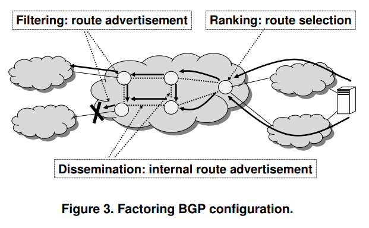
  * Dissemination
    * which router to exchange with
    * internal BGP session
      * full mesh
      * route reflectors: selects a single best route and announces that route to all of its “clients”  
        * easily misconfigured
    * external BGP session
  * Filtering
    * A router’s configuration can prevent a certain route from being accepted on inbound or readvertised on outbound.  
  * Ranking
    * Any given router may learn more than one route to a destination, but must select a single best route. Configuration allows a network operator to specify which route is the most preferred route to the destination among several candidates.  
* Manipulating attributes
  * controlling how a router ranks candidate routes, 
  * controlling the “next hop” IP address for the advertised route, 
  * labeling a route to control whether another router filters it  
* normalized representation: set of relational database tables
  * 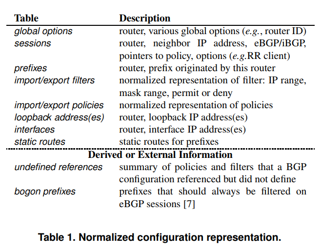
  * A relational structure is natural  
    * many sessions share common attributes  
    * many policies have common clauses  
* Defining a Correctness Specification  
  * routing logic  
  * a route is a BGP message that advertises reachability to some destination via an associated path 
  * a path is a sequence of IP hops (i.e., routers) between two IP addresses  
    * a path is usable if it  
      * reaches the destination  
      * conforms to the routing policies of ASes on the path  
  * Path visibility implies that every router learns at least one route for each destination it can reach via a usable path 
    *  violated by dissemination or filtering
    * iBGP prevents dissemination of eBGPs
  * Route validity implies that every route learned by a router describes a usable path, and that this path corresponds to the actual path taken by packets sent to the destination  
    * violated by dissemination or filtering
    * forwarding loop
  * assumes that the internal routing protocol (i.e., interior gateway protocol, or “IGP”) used to establish routes between any two routers within a AS is operating correctly  
  * only detects faults in the BGP configuration of a single AS (a network operator typically does not have access to the BGP configuration from other ASes)  
* Deriving Constraints and Detecting Faults  
  * 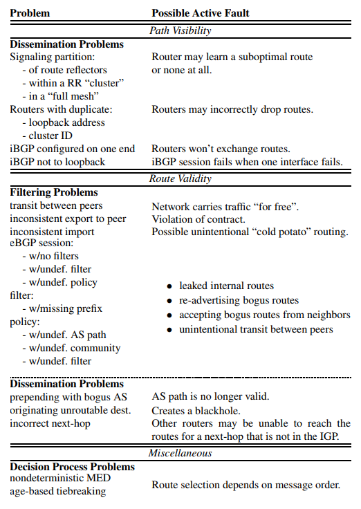
* Completeness & Soundness
  * `rcc` constraints are neither complete nor sound
  * 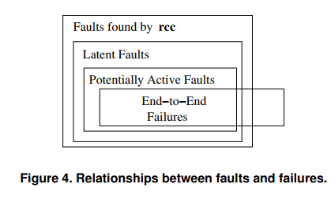
  * Latent faults are faults that are not actively causing any problems but nonetheless violate the correctness constraints.  
  * potentially active faults, for which there is at least one input sequence that is certain to trigger the fault.
  *   

## Path Visibility Faults

* route reflector
  * if the best route was learned from an iBGP peer, the route is readvertised to all of its route reflector clients  
  * if it was learned from a client or via an eBGP session, the route is readvertised on all iBGP sessions  
* 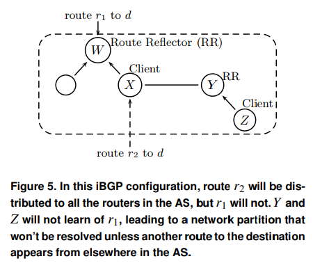
* 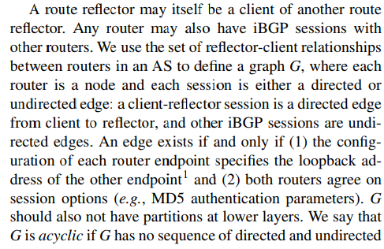
* `G` should be acyclic for a stable path assignment
* Even a connected directed acyclic graph of iBGP sessions can violate path visibility  
* We call this path visibility fault an iBGP signaling partition; 
  * a path exists, but neither Y nor Z has a route for it. 
  * Note that simply adding a regular iBGP session between routers W and Y would solve the problem.  
* 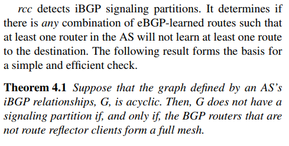
* rcc checks this condition by constructing the iBGP signaling graph G from the sessions table. It assumes that the IGP graph is connected, then determines whether G is connected and acyclic and whether the routers at the top layer of G form a full mesh  

## Route Validity Faults

* 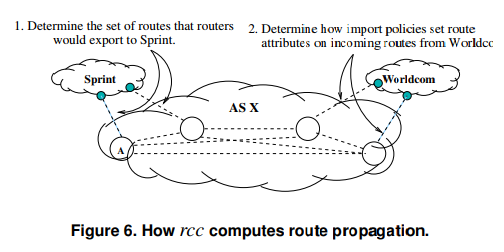
* Typically, a route that an AS learns from one of its “peers” should not be readvertised to another peer
* an AS should advertise routes with equally good attributes to each peer at every peering point. An
  AS should not advertise routes with inconsistent attributes, since doing so may prevent its peer from implementing “hot potato” routing, which typically violates peering agreements  
  * an AS may apply different export policies at different routers to the same peer  
  * an iBGP signaling partition can create inconsistent export policies because routes with equally good attributes may not propagate to all peering routes  
* When the configurations for sessions at different routers to a neighboring AS are the same except at one or two routers, the deviations are likely to be mistakes.  

## Implementation

* Perl
* 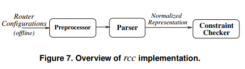
* a preprocessor, which converts configuration into a more parsable version  
  * adds scoping identifiers to configuration languages that do not have explicit scoping  
  * expand macro
* a parser, which generates the normalized representation;
* a constraint checker, which checks the constraints  
  * executing SQL queries against the normalized format and analyzing the results of these queries in Perl  
* 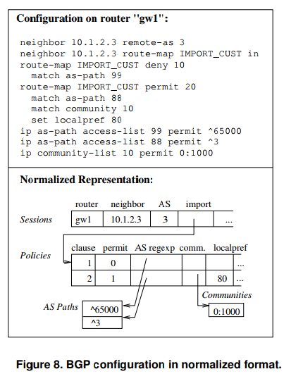
* suggestions
  * protocol improvements, particularly in intra-AS route dissemination, could avert many BGP configuration faults.   
  * BGP should be configured with a centralized, higher-level specification language  

