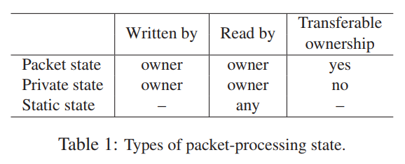
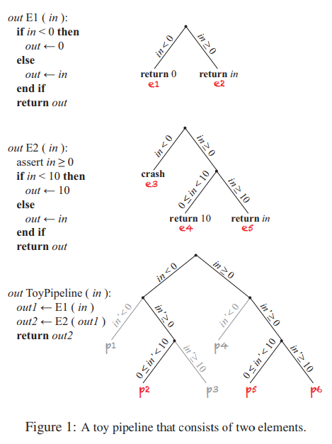
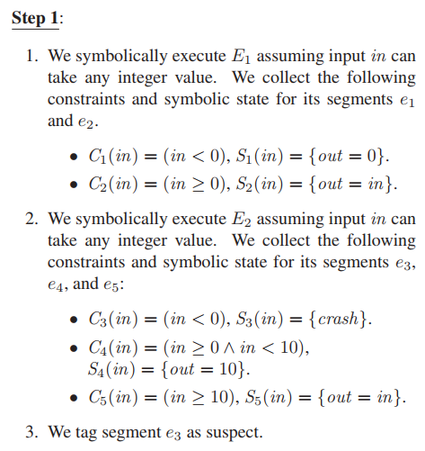
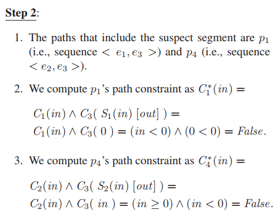
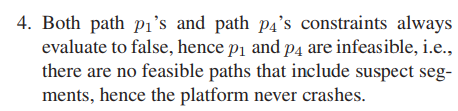
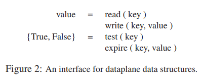

# Software Dataplane Verification  

**Mihai Dobrescu, Katerina Argyraki**

---

## Summary

* In this paper, the authors present a verification scheme applied to specific software dataplane programs. This method requires the software dataplane to behave like a pipeline (decomposable, chaining of modules of dataplane programs). Also the data flow in the pipeline is restricted to be linear and pure: only packets can carry mutable states and only immutable state can be transferred between packets. Under such condition, the authors symbolic executes the segments of pipeline and find potential violations given properties. The violations are verified by composing logical conditions between pipelines to check the satisfiability of path constraints. Since it leverages symbolic execution for generating constraints, the authors proposes three conditions/workarounds to avoid unaccepted path explosion. For loops, only packet can carry the mutable state along all loop body (no loop intervene, so the loop can be flatten). For data structure, the verification uses a common clean interface for read, write, test and expiration. As for mutable private state (including mutable data structure), to avoid handling arbitrary symbolic input, the per-segment symbolic execution consists of one run of assume all private state to be unconstrained and a second run of actually checking violations with restricted mutable private state. The authors test the verification on three problems: crash-freedom (finish normally), bounded-execution (finish definitely), and filtering (packet dropped).
* This paper presents a scheme where path explosion can be alleviated by decomposing programs to individual components. The pipeline structure with immutable state carriers is a very popular scheme among big data systems (e.g., Spark, RDD) so the implication can be widely-used for many systems. So unclear things in the paper is how to handle value-dependent loops, symbolic keys for data structure and the efficiency of the way to handle mutable private state. 

## Introduction

* Software dataplanes are emerging as an alternative to traditional hardware switches and routers, promising programmability and short time to market  
  * cut network provisioning costs by half
  * enable dynamic allocation of packet processing tasks to network devices
  * turn the Internet into an evolvable architecture, by enabling continuous functionality update of devices located at strategic network points  
* Flexibility vs. Reliability
* Verification tool: executable binary of software dataplane + target property
* Verifiability vs. Performance
  * both satisfiable for software dataplane program
  * what defines a “software dataplane”?
  * how much more restricted is it than a “general program”?
  * how much do we need to restrict our dataplane programming model so that we can reconcile verifiability with performance?  
  * assumption: software dataplanes follow a pipeline structure 
    * i.e., they are composed of distinct packet-processing elements (e.g., an IP lookup element, an element that performs Network Address Translation or NAT) that are organized in a directed graph and do not share mutable state  
    * no state interactions between elements (other than one passing a packet to another) makes it feasible to reason about each element in isolation, as opposed to having to reason about the entire pipeline as a whole  
      * modularity
  * proven properties
    * crash-freedom: no packet sequence can cause the dataplane to stop executing  
    * bounded-execution: no packet sequence can cause the execution of more than a known, reasonable number of instructions
    * filtering: e.g., “any packet with source IP A and destination IP B will be dropped by the pipeline"
      * only for a specific configuration

## Setup

### Background

* Symbolic Execution
  * program as execution trees
* Construction of Proofs
  * proof by execution (all feasible path) `=>` path explosion
  * how to avoid path explosion?

### Our Approach

* symbolic execution is a good fit for packet-processing pipelines
  * avoid some kinds of path explosion
  * two elements never concurrently hold read/write permissions to the same mutable state
  * $2^{m n} \to m 2^{n}$
* rely on S2E automated path explorer using symbolic execfution
  * in-vivo program analysis: runs within a real software stack (with libs, kernels, drivers)
  * directly analyze binaries

### Starting Point: Pipeline Structure

* 
* Packet state
  * owned by exactly one element
  * owner can atomically transfer ownership to another element
    * [[I: substructural/linear type system? Rust?]]
  * used for communicating packet content/metadata between elements
* Private state
  * owned by exactly one element
  * never change ownership
  * a map in a NAT element
  * a flow table in traffic monitoring element
* Static state
  * read-only, immutable
* Natural fit for any platform that must perform high-performance streaming
  * otherwise, multiple stages shared access, requires synchronization, leads to contention
  * [[R: common patterns for data streaming frameworks, like RDDs]]

## System

* 
* segment: an instruction sequence through a single element  
* path: an instruction sequence through the entire pipeline
* in: newly received packet (might be symbolic & unconstrained)

### Pipeline Decomposition

* Step 1: search inside each element in isolation for code that may violate the target property
  * for each segment, obtain a logical expression specifying how this segment transforms state
  * symbolic execute the element using constrained symbolic input
  * conservative tag suspect segments
  * 
* Step 2: determine which of these potential violations are feasible once assemble the elements into a pipeline
  * construct each potential path `pi` that includes at least one suspect segment; each `pi` is a sequence of segments `ej`
  * compose the path constraint and symbolic state for `pi` based on the constraints and symbolic state of its constituent segments   
  * for every `pi`, we determine whether it is feasible (based on its constraints) and whether it violates the target property (based on its symbolic state)
  * 
  * 
  * [[I: can we pre-compute a weak pre-condition for each segments?]]
* not straightforward for elements that involve loops, large data structures, and/or mutable private state  

### Loops

* loop decomposition to avoid path explosion
* `t` iterations `=>` multi-pipeline of `t` mini-elements
  * [[Q: what about value-dependent loops? The condition forbid value reading from packet so not value-dependent loops?]]
* first extra condition: only mutable state shared across components must be the packet object itself  
  * otherwise, can't decompose loop
* Condition 1: Any mutable state shared across loop iterations is part of the packet metadata

### Data Structure

* use symbolic value to index an array...
* data structure are abstracted away, use static analysis to solve arduous work with less precision!
* Condition 2: Elements use data structures that expose a key/value-store interface like the one in Fig. 2  
  * 
* data structure as a key/value store
  * read, write, membership test, expiration (element will not be accessed by the element any more)
* Condition 3: Elements use data structures that are implemented on top of verifiable building blocks, e.g., pre-allocated arrays  
  * verified: the implementation of the interface exposed by the data structure is proved to satisfy crash-freedom, bounded-execution, and correctness  
  * hash table: sequence of `K` sized buckets/arrays
  * longest-prefix-match table: flattening of all entries to /24 prefixes
  * array as main building block
    * enable line-rate access to packet-processing state (O(1) lookup time)
    * easy to verify: dynamically-growing structures often incur allocation/deallocation/unpredictable failing
* Overhead of Condition 2 & 3
  * existing elements may need to be rewritten to satisfy them  
  * implementing sophisticated data structures on top of pre-allocated arrays typically requires more memory than conventional implementations  
* [[Q: this seems don't solve the symbolic indexing problem? feed the interface with symbolic value `=>` how to constrain the output value?]]

### Mutable Private State

* symbolic engine fails to handle symbolic inputs of arbitrary length in a  scalable manner
* break verification step 1 into 2 sub-steps
  * search for suspect values of the private state that would cause the target property to be violated
    * assume private state can take any value allowed by its type
  * determine which of these potential violations are feasible given the logic of the element
    * private state is restricted by the particular type of state manipulation performed by the given element
  * [[R: no practical examples, check the technical report]]

## Target Properties

* Crash-freedom
  * guaranteed not to execute any instruction that would cause it to terminate abnormally  
  * abnormal termination depends on environment: SIGSEGV/SIGABRT/SIGFPE/panic
  * equivalent to proving that any such instruction will never be executed
    * what about division by zero?
* Bounded-execution
  * guaranteed to execute no more than `Imax` instructions per packet  
  * map each instruction to the minimum and maximum number of cycles that it can take to complete  
  * longest path
    * step 1: record the length of each segments
    * step 2: search for longest feasible path by considering different segment combinations
    * heuristic: first checks if the path that consists of the longest segment of each element is feasible, then checks if any path that involves either the first or second longest segment of each element is feasible, and so on  
      * worse case: all possible segment combinations
      * in practice: only a few combinations
* Filtering
  * guarantee that a packet that enters the pipeline with source IP A and destination IP B will be dropped  
  * use similar methods as existing work which models the mapping function of device by the contents of its forwarding table; for symbolic execution, it's automatically derived by executing.

## Limitations

* pipeline structure
* three condition overhead
  * existing code may need to be changed  
  * data structures that satisfy Conditions 2 and 3 typically require more memory  
* 

