# Scaling Network Verification using Symmetry and Surgery    

**Gordon D. Plotkin, Nikolaj Biorner, George Varghese, et al**

---

## Summary

* This paper proposes an optimization leveraging network symmetry to scale network verification. The authors formalize networks as graphs of interconnected boxes and network activities as logic transition relations. Therefore, to reduce network boxes and prove the equivalence of semantics, they take advantage of logical bisimulation. They present four kinds of transformations: replacing a core by a hub; removing disconnected components; slicing; and redirect traffic to merge middle-way boxes. To apply transformations on the network. Two questions remain: how to identify symmetries? Does a datacenter network always provide perfect symmetry?
* Q1) What is the difference between a symmetry and a surgery intuitively?
  * Surgery removes irrelevant network boxes. Symmetry models equivalent classes to avoid redundant computations
* Q2) Based on the formal models you have seen, how does Section 2.2 capture the packet sending. What kind of model is this?
  * The packet sending is modelled as logical transition relations between boxes. State machine model.
* Q3) Why are symmetries not as easy as it looks in Figures 1 and 2? What is the key idea that allows it to work in real data centers?
  * Because we need to prove the symmetry works as expected. We need a proof checker with all rules encoded and verify the symmetry cases on the proof checker.
* Q4) What are the limitations of this paper? How could you extend the ideas?
  * I think this paper doesn't cover the part of how to automatically discover potential surgery/symmetry points, therefore we can use logic tools to prove and do transformation. Also, for not perfectly symmetric, we might be able to split the header into symmetric cases & non-symmetric parts. Therefore, we leverage the symmetry on tuple (header, port, rules).

## Introduction

* exploit datacenter regularities
* network transformation: given a reachability formula & network, network `->` simpler network
* network surgery: irrelevant/redundant sets of nodes/headers/ports/rules are sliced away
* network symmetry: between backup routers
* Van Benthem-Hennessy-Milner style bisimulation
  * associate bisimulations to transformations connecting network & formulas with their transformation
* 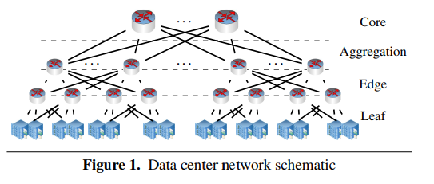
* Network consists of boxes
  * routers
  * switches
  * firewalls
* dataplane/forwarding component of router `=>` set of rules that map predicates on packet headers
  * ACLs: complex predicates, may prescribe changes in packet headers
  * only enable qualitative reasoning (reachability, looping)
    * abstracts away quantitative issues (delay), ignore control plane
* Complexity
  * manual rules added by operators interact with the rules computed by automatic routing protocols
  * forwarding typically involve load balancing by which a packet can be sent by many possible routes to its destination
  * routers sometimes rewrite packets
  * program structure is simple, the state space is large
* Early systems: SAT solver, single violation
* Later systems: symbolic execution, multiple violations
* NetPlumber: efficient incremental analysis
* Yang/Lam: predicate abstraction to rewrite router rules

### Scaling Verification Using Network Transformation

* regularities: fat-trees, Clos, PortLand, BCube, MDCube
  * level graphs where routers at a given level are symmetrically connected to multiple routers at adjacent levels  
  * load balancing
  * resiliency
  * `=>` symmetrical with transformation!
    * 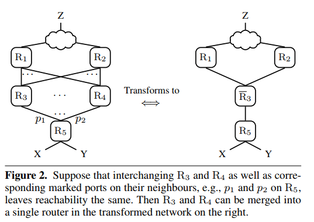
* hierarchical `=>` local substructures
  * slicing irrelevant network (_surgery_)
  * also slice header space to deal with asymmetrics
* Model/Specification: state machine + operational semantics + standard modal logic
* bisimulations: network $\mathcal{N} \leftrightarrow \mathcal{\bar{N}}$
  * [[N: ref to TaPL [slides](http://www.cs.cmu.edu/~fp/courses/15814-f19/lectures/13-bisimulation.pdf)]]
  * Van Benthem-Hennessy-Milner  principle
  * reduce the size of N
  * slicing away parts of the network irrelevant to the proposition   
  * exploiting symmetry either to remove essentially duplicate rules  
  * merge symmetrically placed routers with symmetrical semantics  
  * reduce the number of properties to be verified, by finding symmetries between propositions about symmetrically placed parts of the network or by identifying equivalent packet headers
* Contributions
  * A Theory of Network Dataplanes
  * A Toolbox of Network Dataplanes
  * Scaling Comprehensive Network Verification

## Networks & Their Logics

* network syntax: switching networks as graphs of interconnected boxes of various kinds (routers, switches, bridges, firewalls)
  * 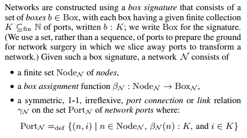
  * box vs nodes: same box (e.g. backup router) can be replicated at different points of the network
* network semantics: suitable kinds of transition relations
  * modal logic
  * $Pac_{\mathcal{N}}$: packet headers ranged over by `h`, header space
  * transition: 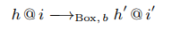
    * just forward: `h = h'`
    * port independent: `h@i1 -> ... = h@i2 ->`
  * $States_{\mathcal{N}}$: states of the network `N` consists of the network-located packets
    * 
    * 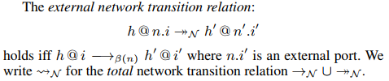
  * network slice: subset `S` of states
    * 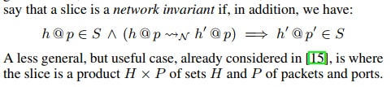
* Network Logic
  * $h \vDash \alpha$
  * 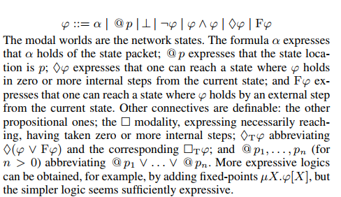
  * 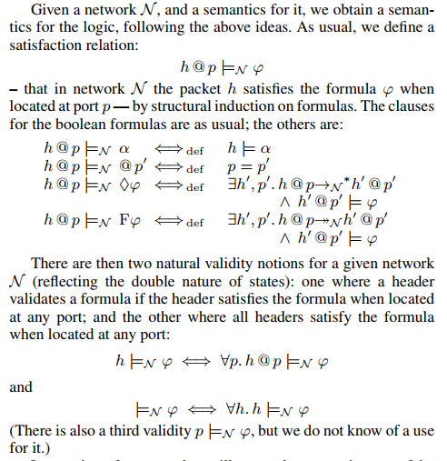
  * 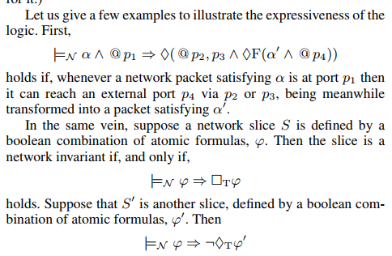
  * 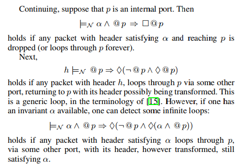
* Surgery
  * replacing the core by a hub
    * 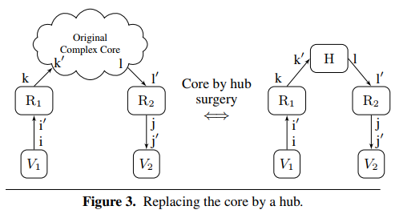
    * obstruction-free
      * 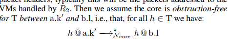
    * 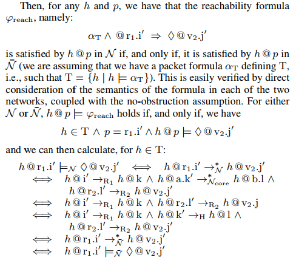

## Network Bisimulations

* 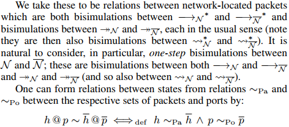
* 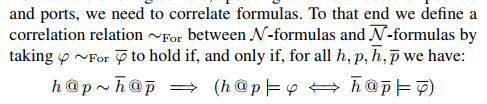
* 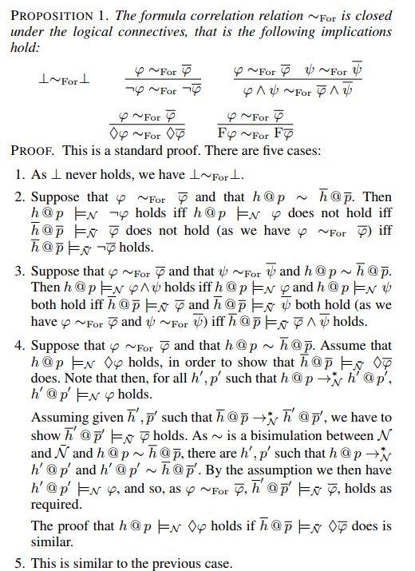
* 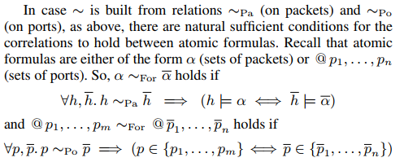

## Network Surgery

* 
* Removing Disconnected Components
  * 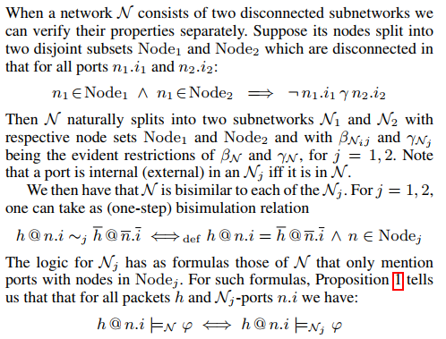
* Slicing
  * P-connected
  * P-leaky
  * 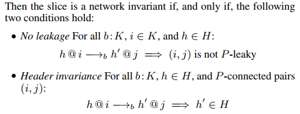
  * 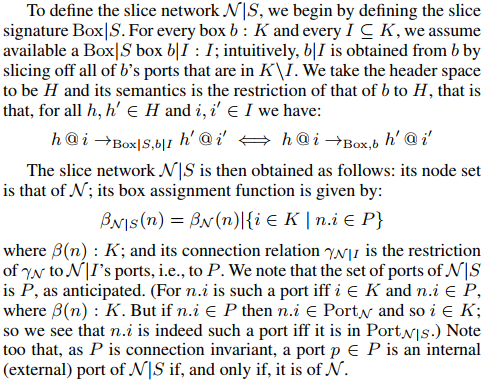
  * [[N: Check original paper for bisimulation proof]]
* Redirecting Traffic
  * 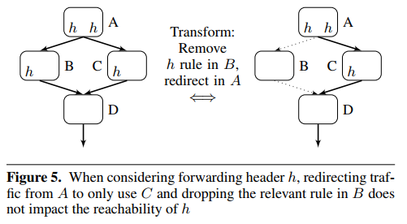
  * 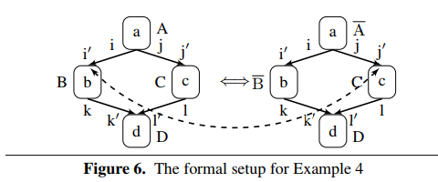

## Composite Bisimulations

* 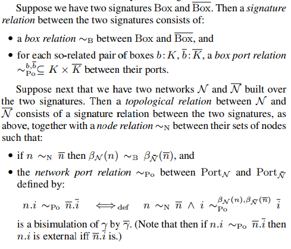
* 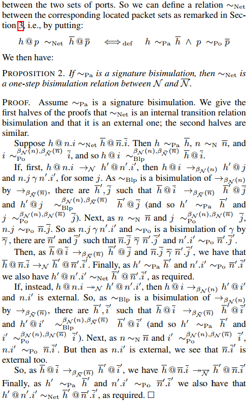

## Network Symmetries & Merging Headers

* composite symmetries `=>`
  * define various notions of symmetries, particularly the topological ones that typically hold in data centers, and then show how local symmetries can be found and also how to divide out  networks by symmetry groups  
  * construct equivalencies between packet headers that allow us to replace assertions about one header by an assertion about an equivalent one, or to go further and replace headers by their equivalence classes  
* Network Symmetry
  * 
  * 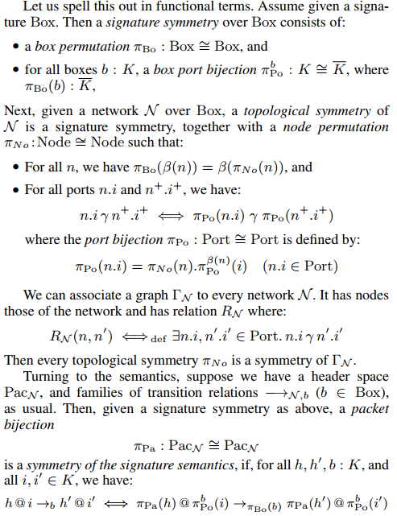
* Merging Headers
  * Check original proofs

## Conclusion

* verifying large scale networks by developing a theory of network transformation  
* easy-to-code versions of simple transformations can provide large speedups  
* all-pairs verification task is easily parallelized  
* enterprise network: core network, interconnects a number of leaf networks
* ISP network: Points of Presence (POPs) uses complete mesh topologies
* modular verification
* relational semantics, modeling nondeterminism

## Wordings

* $\mathcal{N}$: network space
* $\beta_\mathcal{N}$: box assignment function in network $\mathcal{N}$
* $\gamma_\mathcal{N}$: link relation between ports in network $\mathcal{N}$
* $h@i$: packet `h` on box port `i`
* $K$: finite collection of ports
* $b$: Boxes
* $Pac_\mathcal{N}$: header space of $\mathcal{N}$
* $h@i \to_{Box, b} h'@i'$: transition for each box $b \in Box$
* $\longrightarrow_{\beta(n), \mathcal{N}}$: internal network transition
* $\twoheadrightarrow_{\beta(n), \mathcal{N}}$: external network transition
* $\rightsquigarrow$: total network transition
* $*$: transitive closure
* $\diamond$: one can reach ... in 0+ steps
* `F`: one can reach a state where passing an external step from current state
* `@`: state location
* $\alpha$: formula express the state of the packet
* $\vDash_\mathcal{N}$: in network $\mathcal{N}$ it satisfies
* `~`: bisimulation relationship
  * $\sim_{P_a}$:  signature bisimulation
  * $\sim_{P_o}$: port bisimulation
  * $\sim_{For}$: formula bisimulation
* $\mathcal{N}\mid\mathcal{S}$: slice network
* $Box \mid S$: slice signature
* $b \mid I$: obtained from b by slicing off all b's ports that are in K/I
* $\pi$: permutation
* 

