# Real-time Verification of Network Properties using Atomic Predicates  

**Hongkun Yang, Simon S. Lam**

---

## Summary

* This paper presents an optimization to represent a large amount of predicates by equivalent classes of atomic predicates (minimum exclusive split of the header space). The authors convert ACL/forwarding table rules into BDD predicates and for the set of all predicates, they do cross-products one by one. Normally this will create an exponential number of new predicates, however, most cross products provide an empty intersection and the total computation time and number of atomic predicates remain small. Therefore, we can transform computation of headers into intersection of integer-indexed atomic predicates. For real-time incremental atomic predicate generating, the authors leverage a shadow reachability tree and re-compute the atomic predicates in background.
* This paper shows we can view header space as a split of exclusive blocks instead of bits or overlapping predicate objects. Some question remains: which properties guarantee the network will generate a small amount of atomic predicates? Can we apply atomic predicate technique on a network after it has been reduced by symmetric transformations?
* a) In some sense the main idea is like a basis in math. In math we can rewrite a vector in terms of its x,y,z projections and then compute the results in each dimension and then combine later. What is the basis in this paper and what is being rewritten.
  * The orthogonal basis is the atomic predicates.
* b) Why is the rewrite (which takes some precomputation) useful for efficiency
  * Because we can avoid header space computation by doing integer set operations
* c) What is the essence of the algorithm for computing atomic predicates (it can be stated in one line roughly speaking).
  * Cross-product all predicates representing ACL/forwarding table rules
* d) Why is some care needed in the order when you compute Atomic Predicates for ACLs? Why did they separate Atomic Predicates for ACLs from those for Prefixes?
  * By computing atomic predicates for ACL, the authors find that starting from the smallest ACL will keep the number of atomic predicates low until the very end of the computation (save computation time), while for forwarding predicates, random and manual selection remains the same. It shows the small ACLs have most of them non-overlapped.
* e) What are the results saying? What is one major hole in the evaluation for Symmetries and Surgeries?
  * The result reveals that the atomic predicate method is super effective and the header space can be represented succinctly using atomic predicate equivalence classes (might be an interesting nature of network). One major hole I remember if header space symmetry (just like atomic predicate) actually plays the major role of the symmetries and surgeries optimizations.

## Introduction

* Atomic Predicates (AP) Verifier  
  * time/space efficient
  * predicate representing packet filters `=>` minimum, unique set of atomic predicates
  * atomic predicates
    * each given predicate is equal to the disjunction of a subset of atomic predicates
    * can be stored & represented as a set of integers that identify the atomic predicates
    * conjunction/disjunction `=>` intersection/union of 2 sets of integers
    * [[N: prime implicate/implicants? The atomic predicates should be less than 2^n?]]
  * process real-time dynamic state changes
* fast computation of reachability
  * old ways: worst case $O(2^n)$

## Network Model

* packet network `=>` directed graph of middle boxes (switch/router, forwarding table, IO ports guarded by ACLs)
* predicates `=>` BDDs (JDD package)
* ACL:: `Gi` (predicates), `actioni` (allow/deny)
* 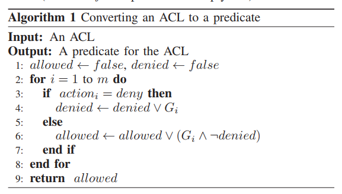
* predicate of an ACL rule can be represented by a BDD with `≤ 2 + 2h` nodes, where `h` is the number of bits in the packet header given allowed values of each header field in an ACL rule are specified by a suffix, prefix or an interval  
  * [[Q: how? Is it for single rule?]]
  * multiple disjoint intervals `=>` can be larger
* forwarding rule: `Prei`(predicate), `Li` (prefix length, max `m`), `porti` (port)
* 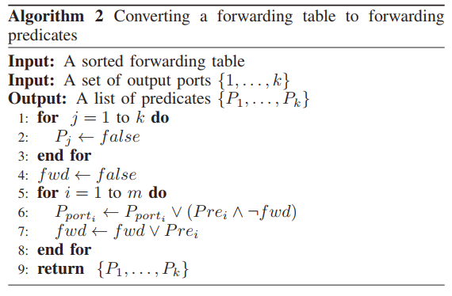
  * observation: \# of BDD nodes used to represent an ACL/forwarding table increases approximately linearly with the number `m` of rules in the ACL/table up to a maximum and then decreases as `m` increases further
    * [[N: Linear Fragmentation Assumption?]]
* 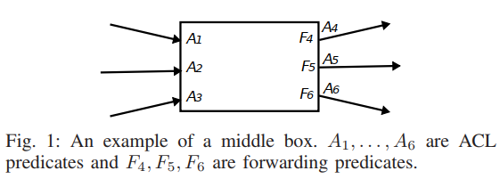

## Atomic Predicates

* 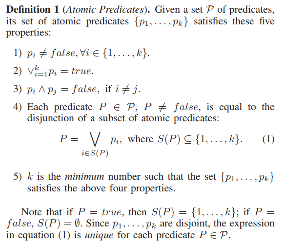

* 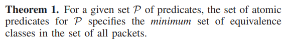

  * > The set of atomic predicates together with the network topology preserve all network reachability information but without any redundant information in ACL rules and forwarding rules  

  * >  Operations on predicates (or operations on packet sets) are highly computation-intensive because they operate on many packet header fields. Using atomic predicates, these computation-intensive operations are replaced by operations on sets of integers (i.e., identifiers of atomic predicates) with a dramatic decrease in computation time  

* 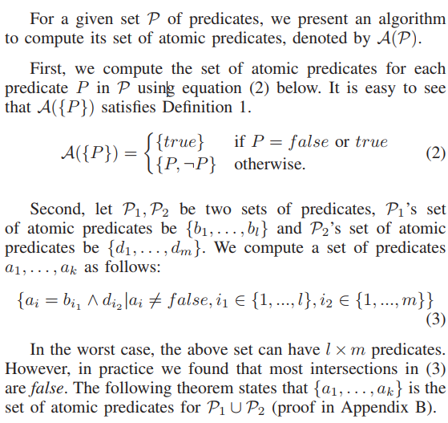

  * > in practice we found that most intersections in the cross-product are false 

  * [[N: That's interesting. What's the implication behind this? Symmetry? Slicing?]]

* 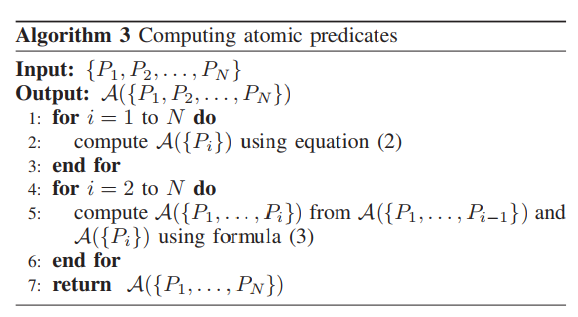

* 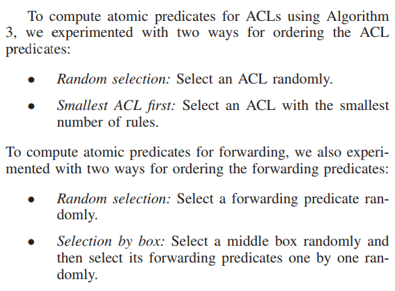

* forwarding & ACL rules have different characteristics & locality properties

  * separate ACL/forwarding rules

* 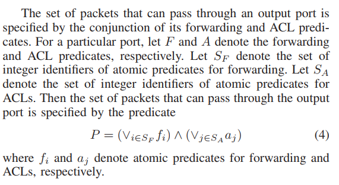

## Computing Reachability & Verifying Network Properties

* 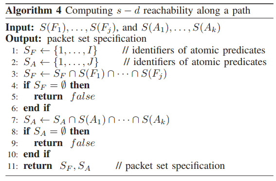
* 256 times faster than Hassel
* atomic predicate union instead of manual calculation
* [[Q: How to specify the path?]]
  * DFS from source port `=>` reachability tree
  * also detects loop `=>` non-empty predicate reaches old boxes
  * 
* Optimizations
  * hash table `HT` of (port number, set of tree nodes with that port number)
    * query reachability set from source port to destination port
  * store the set of ports along the path from `s` to the tree node `y` in each tree node
    * faster loop detection instead of traversing the reachability tree
  * if set of integer identifiers is too large, use complement
* Blackhole detection: drop packets due to no forwarding entry
  * set of blackholes for a box `S(true) - U S(Fi)`
* Slice Isolation: compute ACL/forwarding predicate union
* Required Waypoints: by reachability tree

## Real-Time Compliance Check for Network State Changes

* Line Status Change
  * recompute `HT`, update reachability tree
  * link down: `HT(down ports)`, remove nodes & all descendant nodes from reachability tree/hash table
  * link up: `HT(up ports)`, DFS search on nodes
  * 4-5 orders of magnitude faster than NetPlumber
* Rule Update
  * change port predicates
  * checks if a port predicate changed by update; if so `=>` compute new predicate for the port
  * update the reachability tree using the new predicate, if any (temporary tree)
  * forks a process to update the set of atomic predicates (concurrent with above)
  * using a temporary reachability tree
    * [[N: how? won't the new predicate affects all atomic predicates? New cross-products rise]]
  * 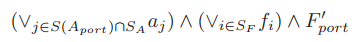

## Conclusion

* mystery atomic predicates from simple cross-products...
  * maximum usage of equivalent classes!

